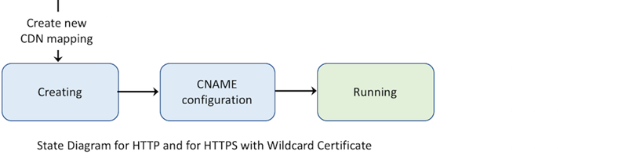
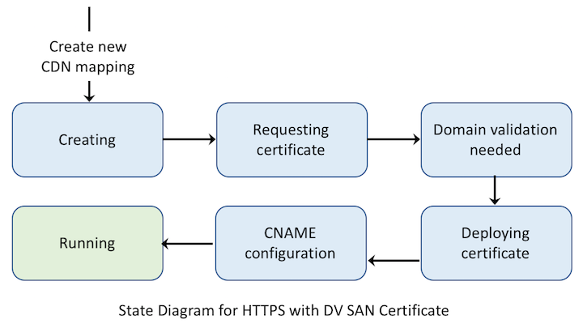

---

copyright:
  years: 2018
lastupdated: "2018-06-28"

---

{:shortdesc: .shortdesc}
{:new_window: target="_blank"}
{:codeblock: .codeblock}
{:pre: .pre}
{:screen: .screen}
{:tip: .tip}
{:download: .download}

# About HTTPS

IBM Cloud offers two ways to secure your CDN with HTTPS - Wildcard Certificate and Domain Validation (DV) SAN Certificate. Both HTTPS options can be configured by selecting **HTTPS Port** when configuring your CDN. The default HTTPS Port is 443, or you can choose a different port number to route your HTTPS traffic through. A list of allowed port numbers can be found in the [FAQ](faqs.html#are-there-any-restrictions-on-what-http-and-https-port-numbers-are-allowed-for-akamai-).

## Wildcard Certificate support
>The Wildcard certificate is the simplest way to deliver web content to your end-users securely. The full CDN CNAME, including the Wildcard certificate suffix, **must** be used as the service entry point (for example, `https://example.cdnedge.bluemix.net`) in order to use the Wildcard certificate.
>
>IBM Cloud CDN uses the Wildcard certificate `*.cdnedge.bluemix.net`. The CNAME, regardless of whether it was created for you or provided by you, and ending in suffix `*.cdnedge.bluemix.net` is added to the wildcard certificate maintained on the CDN Edge server. And thus CNAME becomes the only way for end users to use HTTPS for your CDN.

## Subject Alternate Name (SAN) Certificate Support

>Subject Alternative Name (SAN) Certificate is a digital SSL certificate that allows multiple domains, or hostnames, to be protected by a single certificate.
>
>With SAN certificate for HTTPS, your primary CDN Hostname is added to a certificate that has been issued by a Certificate Authority. This allows your users the ability to access your service securely via the hostname rather than the CNAME; for example, `https://www.example.com`.
>
>When the CDN order is placed using HTTPS SAN certificate, it goes through the process of requesting a certificate and creating a Domain Control Validation (DCV). DCV is the process a Certificate Authority uses to establish that you are authorized to access and control the domain. Your action is required in order to complete this step. After control has been established, the certificate is deployed to the CDN Edge Servers around the world. Once the certificate is successfully deployed, the renewal of the certificate is handled automatically. More information on this feature can be found in the [feature description](feature-descriptions.html#https-protocol-support). Domain Control Validation methods are explained in more detail on the [Completing Domain Control Validation for HTTPS](how-to-https.html#initial-steps-to-domain-control-validation) page.

