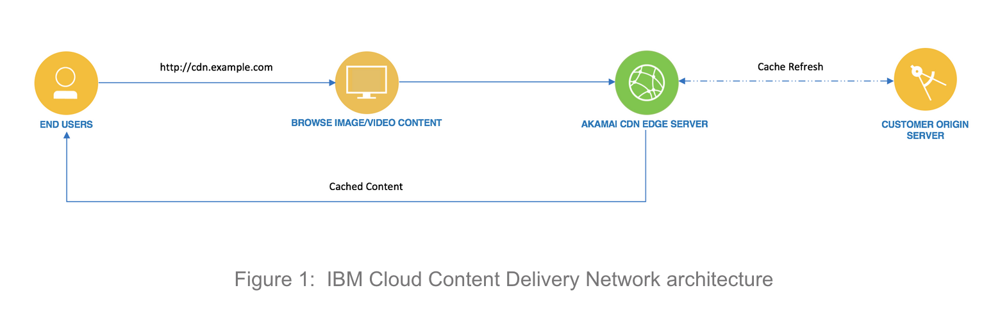

---

copyright:
  years: 2017, 2018
lastupdated: "2018-11-01"

---

{:shortdesc: .shortdesc}
{:new_window: target="_blank"}
{:codeblock: .codeblock}
{:pre: .pre}
{:screen: .screen}
{:tip: .tip}
{:download: .download}

# About Content Delivery Networks (CDN)

A Content Delivery Network (CDN) is a collection of edge servers that are distributed through various parts of the country or the world. Web content is served from an edge server, which is located in the geographic area closest to the customer who requests the content. This technique lets your end-users receive the content with less delay, and it delivers a better overall experience for your customers.

## How does a CDN work?

A CDN achieves its purpose by caching web content on edge servers around the world. When a customer requests web content, the content request is routed to the edge server that is geographically closest to that customer. By reducing the distance the content must travel, the CDN offers optimized throughput, minimized latency, and increased performance. Using IBM Cloud Content Delivery Network with Akamai, content providers can realize efficient delivery of requested content from around the globe, with minimal configuration.

## Features

The key features of the IBM Cloud Content Delivery Network service include:
  * Host Server Origin support
  * Object Storage Origin support
  * Support for Multiple Origins with distinct paths
  * Path-based CDN mappings
  * Purge cached content
  * Time to Live (TTL)
  * Metrics with graphical views
  * HTTPS Protocol support with Wildcard and DV SAN certificate
  * Host Header support
  * Serve Stale content
  * Cache Key Query Args
  * Content Compression
  * Large File Optimization
  * Video on Demand
  * Geographical Access Control
  * Hotlink Protection

Please see [this document](feature-descriptions.html#feature-descriptions) for full feature descriptions.

## Architectural Diagram

The following diagram offers a schematic overview of the three-tier architecture of IBM Cloud CDN.

