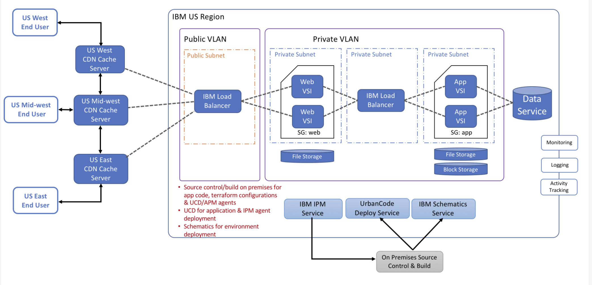

---

copyright:
  years: 2017, 2020
lastupdated: "2020-12-29"

keywords: content delivery network, CDN

subcollection: CDN

---

{:shortdesc: .shortdesc}
{:new_window: target="_blank"}
{:codeblock: .codeblock}
{:pre: .pre}
{:screen: .screen}
{:term: .term}
{:tip: .tip}
{:note: .note}
{:important: .important}
{:deprecated: .deprecated}
{:table: .aria-labeledby="caption"}
{:external: target="_blank" .external}
{:table: .aria-labeledby="caption"}
{:generic: data-hd-programlang="generic"}
{:download: .download}
{:DomainName: data-hd-keyref="DomainName"}

# About Content Delivery Networks
{: #about-content-delivery-networks-cdn-}

A Content Delivery Network (CDN) is a collection of Edge servers that are distributed through various parts of the country or the world. Web content is served from an Edge server, which is located in the geographic area closest to the customer who requests the content. This technique allows your users to receive the content with less delay, and delivers a better overall experience for your customers.
{:shortdesc}

## How does a CDN work?
{: #how-does-a-cdn-work}

A CDN achieves its purpose by caching web content on Edge servers around the world. When a customer requests web content, the content request is routed to the Edge server that is geographically closest to that customer. By reducing the distance that the content must travel, the CDN offers optimized throughput, minimized latency, and increased performance. Using {{site.data.keyword.cloud_notm}} Content Delivery Network with Akamai, content providers can realize efficient delivery of requested content from around the globe, with minimal configuration.

## CDN architectural diagram
{: #architectural-diagram}

The following diagram offers a schematic overview of the three-tier architecture of {{site.data.keyword.cloud_notm}} CDN.

## CDN features
{: #features}

The {{site.data.keyword.cloud_notm}} Content Delivery Network service includes the following key features.

  * [Host server origin support](#host-server-origin-support)
  * [Object storage origin support](#object-storage-file-support)
  * [Support for multiple origins with distinct paths](#support-for-multiple-origins-with-distinct-paths)
  * [Path-based CDN mappings](#path-based-cdn-mappings)
  * [Purge-cached content](#purge-cached-content)
  * [Time to Live (TTL)](#time-to-live-ttl)
  * [Metrics with graphical views](#metrics-with-graphical-views)
  * [Host Header support](#host-header-support)  
  * [HTTPS protocol support with Wildcard and DV SAN certificate](#https-protocol-support)
  * [Respect Headers](#respect-headers)
  * [Serve Stale content](#serve-stale-content)
  * [Cache Key query optimization](#cache-key-optimization)
  * [Content Compression](#content-compression)
  * [Large file optimization](#large-file-optimization)
  * [Video on Demand](#video-on-demand)
  * [Dynamic Content Acceleration](#dynamic-content-acceleration-description)
  * [Geographical Access Control](#geographical-access-control)
  * [Hotlink Protection](#hotlink-protection)
  * [Token Authentication](#token-authentication)
  * [Modify Response Header](#modify-response-header)

Features that are included with {{site.data.keyword.cloud_notm}} CDN powered by Akamai are described as follows.

### Host server origin support
{: #host-server-origin-support}

{{site.data.keyword.cloud_notm}} Content Delivery Network (CDN) can be configured to serve content from a host server origin by providing the origin hostname, protocol, port number, and optionally, the path from which to serve the content. The default path is `/*`. Protocol can be HTTP, HTTPS, or both. Only certain port numbers are supported by Akamai. See the [FAQ](/docs/CDN?topic=CDN-faqs#are-there-any-restrictions-on-what-port-numbers-are-allowed) for supported port numbers and ranges.

### Object storage origin support
{: #object-storage-file-support}

{{site.data.keyword.cloud_notm}} CDN can be configured to serve content from an object storage endpoint by providing the endpoint, the bucket name, protocol, and port. Optionally, you can specify a list of file extensions to allow caching for files only with those extensions. All objects in the bucket must be set with anonymous read or public read access.

For more information, see [Accelerate delivery of static files using a CDN](/docs/solution-tutorials?topic=solution-tutorials-static-files-cdn).

### Support for multiple origins with distinct paths
{: #support-for-multiple-origins-with-distinct-paths}

In certain cases, you might want to deliver certain content from a different origin server. For example, you might want certain photos or videos that are served from different origin servers. {{site.data.keyword.cloud_notm}} CDN provides the option to set up multiple origin servers with multiple paths. This allows flexibility with regards to how and where the data is stored.

The path that is specified for the origin server must be unique regarding the CDN. The origin server itself does not need to be unique.
{: note}

### Path-based CDN mappings
{: #path-based-cdn-mappings}

Your {{site.data.keyword.cloud_notm}} CDN service can be restricted to a particular directory path on the origin server by providing the path when you create the CDN. A user is allowed access only to those contents in that directory path. For example, if a CDN `www.example.com` is created with path `/videos`, it is accessible **only** through `www.example.com/videos/*`.

### Purge-cached content
{: #purge-cached-content}

{{site.data.keyword.cloud_notm}} CDN provides the capability to conveniently and quickly remove, or "purge", the cached content from the Edge servers. With the introduction of the [purge group](/docs/CDN?topic=CDN-cdn-api-reference#api-for-multiple-file-purge) concept, paths can be classified into related groups, which can be purged at the same time. Purge groups can include 1000 paths, by default. A Purge operation with Akamai completes in about 5 seconds. You can also view your purge history, and save specific purge groups as favorites.

### Time to Live (TTL)
{: #time-to-live-ttl}

Time to Live indicates the amount of time (in seconds) the Edge server retains the cached content for that particular file or directory path. When a CDN is first created, a global TTL is created for path `/\*` with a default time of 3600 seconds. The minimum value for TTL is 0 seconds, and the maximum value is 2147483647 seconds. For each entry, the TTL path must be unique for the CDN. If multiple paths match a given content, the most recently configured path match applies to that content. For example, consider two TTLs, `/example/file` created first with a time to live value of 3000 seconds and `/example/*` is created later, with a value of 4000 seconds. Although `/example/file` is more specific, `/example/*` was created most recently, so the TTL for `/example/file` is 4000 seconds. After creation, TTL entries can be edited for path, time, or both. TTL entries can also be deleted.

### Metrics with graphical views
{: #metrics-with-graphical-views}

Metrics for an individual CDN are provided on the Overview tab of the customer portal for that CDN mapping. Two types of metrics are calculated from the CDN's usage: those that show the metrics over a time period as a graph, and those that are shown as aggregate values.

For metrics that display the change over a period of time as a graph, you can see three line graphs and a pie chart. The three line graphs are: **Bandwidth**, **Hits by Mapping**, and **Hits by Type**. They display the activity daily over the course of your specified timeframe. The graphs for **Bandwidth** and **Hits by Mapping** are single-line graphs, whereas the breakdown of **Hits by Type** shows a line for each of the hit types provided. The pie chart displays a regional breakdown of the bandwidth for a CDN mapping on a percentage basis.

Metrics that are shown for aggregate values include **Bandwidth Usage** in GB, **Total Hits** to the CDN Edge server, and the **Hit Ratio**. Hit Ratio indicates that the percentage of times content is delivered by the Edge server, _not_ through its origin. Hit ratio currently is shown as a function of all your CDN mappings, not just the one being viewed.

By default, both the aggregate numbers and the graphs default to show metrics for the last 30 days, but you can change this through the [{{site.data.keyword.cloud_notm}} console](https://{DomainName}/){: external}. Both categories can display metrics for 7-, 15-, 30-, 60-, or 90-day periods.

### Host Header support
{: #host-header-support}

The Edge server uses the **Host Header** when the server communicates with the origin host. This feature provides flexibility in how the web service is configured on the origin host. Specifically, it enables a use case where a client has multiple web servers that are configured on the same origin host. If host header input is not provided, the service uses the origin server hostname as the default HTTP host header if the origin server is specified as the hostname (rather than as an IP address). If a host header is not provided as input and the origin server is provided as an IP address, the CDN hostname (also called the CDN domain name) is used as the default HTTP host header.

### HTTPS protocol support
{: #https-protocol-support}

You can configure CDN to use HTTPS protocol to serve the content securely to the users. This configuration requires that an SSL certificate be set up as part of the CDN configuration. Two types of SSL certificate options are available for HTTPS: [Wildcard certificate](/docs/CDN?topic=CDN-about-https#wildcard-certificate-support) and [Domain validated (DV) Subject Alternative Name (SAN) certificate](/docs/CDN?topic=CDN-about-https#san-certificate-suport). This type is also referred to as a _SAN certificate_.

The type of SSL certificate to use is an important consideration for HTTPS CDN. Wildcard certificate configuration is fast, but it has the downside that the CDN is accessible only by using a CNAME. The SAN certificate process takes 4 - 8 hours to complete, but it allows you to use the CDN with the CDN Domain (that is, the hostname). The SAN certificate also requires an additional step of [**Domain Control Validation**](/docs/CDN?topic=CDN-completing-domain-control-validation-for-https-with-dv-san) during configuration. No cost is associated with using either of these certificates. For more information, see [What is the expected behavior when loading the CNAME or hostname on your browser for the supported protocols?](/docs/CDN?topic=CDN-troubleshoot-cdn-loading-cname-hostname) to understand the implication of selecting a given certificate type.

The origin host also must have its own SSL certificate for the CDN hostname, and it must be signed by a recognized certificate authority.

As an industry best practice, Akamai only trusts the root certificates and not the intermediate certificates because the set of intermediary certificates that is trusted changes frequently. You can find the Akamai trusted certificates on the Akamai community site at [SSL/TLS certificate chains for Akamai-managed certificates](https://community.akamai.com/docs/DOC-4447-ssltls-certificate-chains-for-akamai-managed-certificates).

### Respect Headers
{: #respect-headers}

The **Respect Headers** option allows the HTTP header configuration in the origin to override the CDN configuration. The default value for respect header is `OFF`, which means the CDN always caches your contents by default. For more information, see [Controlling an HTTP client's cache duration](/docs/CDN?topic=CDN-using-cache-control-to-control-an-http-client-s-cache-duration).

### Serve Stale content
{: #serve-stale-content}

When the CDN Edge server receives a user request, and the requested content is not cached, the Edge server reaches out to the origin host to fetch the content. That content is then cached for the TTL duration specified for the content. If a user request is received after the TTL has expired, the Edge server reaches out to the origin host to fetch the content. If the origin server cannot be reached for some reason (for instance, the origin host is down, or there is a network issue), the Edge server serves the expired (stale) content to the request. This feature is supported by Akamai and **cannot** be turned off.

### Cache Key query optimization
{: #cache-key-optimization}

Akamai Edge servers cache content on a **Cache Store**. To use the content from the **Cache Store**, Edge servers use a **Cache Key**. Typically, a cache key is generated based on a portion of a user's URL. In some cases, the URL contains query function arguments that are different for individual users, but the content that is delivered is the same. By default, Akamai uses the query function's arguments to generate the cache key, and therefore, to generate a unique Cache Key for each user. This method is not optimal because it causes the Edge server to contact the origin server for content that is already cached, but that uses a different cache key. You can use the **Cache Key Optimization** feature to specify which query args to include or ignore when generating a Cache Key. This feature applies to any `create` or `update` of a CDN-Mapping configuration, as well as any `create` or `update` of an origin path.

You can configure the value of **Cache Key Optimization** from the **Settings** tab after creation of a CDN mapping. An origin path can be configured during the `create` or `update` operations of an origin path.
{: note}

### Content Compression
{: #content-compression}

By default, **Content Compression** is enabled in Akamai CDN for the following content types:

* text/html*
* text/css*
* text/xml*
* text/json
* text/javascript*
* text/plain*
* application/x-javascript*
* application/json
* application/xml*

When compression is handled by the Edge server, then the content must be at least 10 KB. In some cases, compression is taken care of by the origin server, and in those cases, there is no limit on the size of the files to be compressed. If the content is already being compressed by the origin server, it is not compressed again. To enable Content Compression, the request header must define `Accept-Encoding: gzip`.

### Large file optimization
{: #large-file-optimization}

Large file optimization allows the CDN network to optimize the delivery of content greater than 10 MB. This enablement increases performance for large files and reduces latency and download times. Without this feature, the CDN cannot service files greater than 1.8 GB. This feature allows file downloads greater than 1.8 GB, up to a maximum of 320 GB.

For large file optimization to work, byte-range requests must be enabled on the origin server. Akamai CDN employs a technique that is called _Partial Object Caching_ for this optimization. When a large file is requested, the Edge server checks whether the file meets the size requirements. This means that files larger than 10 MB are requested from the origin server in chunks. After the chunk arrives at the Edge server, it is cached and immediately served to the user. The next chunk is pre-fetched in parallel by the Edge server, thus reducing latency. This process continues until the entire file is retrieved, or the connection is terminated.

When this feature is enabled, there is a slight performance cost that is associated with serving content smaller than 10 MB. Therefore, this feature is recommended only for serving large files. A typical use case would be to create a new origin path in the CDN configuration and enable large file optimization for that path.

### Video on Demand
{: #video-on-demand}

**Video on Demand** performance optimization delivers high-quality streaming across various network types. By using preconfigured cache control settings and the distributed network's ability to distribute the load dynamically, {{site.data.keyword.cloud_notm}} CDN with Akamai gives you the ability to scale rapidly for large audiences, whether you've planned for them or not.

**Video on Demand** is optimized for distribution of segmented streaming formats such as HLS, DASH, HDS, and HSS. Currrently, live video streaming is not supported. You can enable the **Video on Demand** feature by selecting this option from the **Optimize for** menu on the Settings tab, or while creating a new origin path. You should enable this feature only when optimizing delivery of video files.

### Dynamic Content Acceleration
{: #dynamic-content-acceleration-description}

You can configure {{site.data.keyword.cloud_notm}} CDN to serve content with Dynamic Content Acceleration (DCA) optimization. The performance of web pages with dynamic content can be measurably improved. For more information, see [Configuring Dynamic Content Acceleration](/docs/CDN?topic=CDN-dynamic-content-acceleration).

### Geographical Access Control
{: #geographical-access-control}

Geographical Access Control is a rule-based behavior that enables you set the `access-type` parameter for a group of users, based on their geographical location. Two types of behaviors are available: **Allow** and **Deny**.

The access-type `Allow` lets you specifically allow traffic to selected regions, based on the type of region. Allowing traffic for specific regions implicitly blocks traffic for all others. For example, you might choose to `Allow` traffic to selected continents, such as Europe and Oceania, which blocks access for all other continents.

In contrast, the `Deny` behavior blocks access to your service for the specified group, but allows access for all other, non-specified regions. For example, if you set the Geographical Access Control access-type to `Deny` for the continents of Europe and Oceania, users on those continents are not able to use your service, whereas users on all other continents have access to it.

This feature is accessible from the **Settings** page of your CDN configuration.

### Hotlink Protection
{: #hotlink-protection}

Hotlink Protection is a rules-based behavior that enables you to control whether certain websites are allowed access to your content from your CDN. The browser typically includes a `Referer` header when an HTTP request is made from a link on a web page, and when that link points to a remote asset. The link that one website uses for access to an asset from another website is called a _hotlink_. Two types of behaviors are available: **ALLOW** and **DENY**.

If your `protectionType` is set to `ALLOW`:

   * If the `Referer` header value in a request sent to your CDN matches one of your specified `refererValues`, your CDN serves the content requested. Otherwise, your CDN does not serve the content.

If your `protectionType` is set to `DENY`:

   * If the `Referer` header value in a request sent to your CDN matches one of your specified `refererValues`, your CDN does not serve the content requested. Otherwise, your CDN serves the content.

### Token authentication
{: #token-authentication}

Token authentication is the process of generating tokens, associating them with an authenticated user session, and validating the request by using these tokens to prevent unauthorized sharing of links to your content. For more information, see [Working with token authentication](/docs/CDN?topic=CDN-working-with-token-authentication).

### Modify Response Header
{: #modify-response-header}

`Modify-response-header` can modify the outgoing response headers that are sent from the Edge server back to the client. There are three types for the `modify-response-header`: 

  - `append` - Add a given header value to a header name set in the headerList.
  - `overwrite` -  Match a specified header name and replace its existing header value with a new one that you specify.
  - `delete` - Remove a given header value from a header name set in the headerList.
  
For more parameters, refer to the [Modify Response Header Container](/docs/CDN?topic=CDN-modify-response-header-container).

Note the following when using `modify-response-header`:

  * You can modify a maximum of 15 headers for a domain mapping.
  * You can use each `modify-response-header` type (`append`, `overwrite` and `delete`) one time in a path.
  * You can't modify the same header more than one time for a domain mapping.
  * You can't use a CRLF or a colon (:) in header names or header values.
  * The `append` and `overwrite` types create a non-existent header and apply the specified header value.
  * The `append` type for `modify-response-header` won't append a header value if it exists in the header. If duplicate instances of a header value are identified, no action is taken. Use the `overwrite` type in this scenario to completely replace the header content and remove duplicate values.
  * If multiple occurrences of a single header are included in a response, an `append` or `delete` type `modify-response-header` applies only to the first occurrence.
  * The `delete` type can be used to remove an empty header (if it has no header value). Simply include the header name, and leave the header value empty (for example, `"my_header"` or `"my_header:"`).
  * The `delete` type only removes a value from a header if that value is found. If the value isn't found, it does nothing.
  * Header names are case-insensitive when matching eligible headers, for all types.
  * Header values are case-sensitive when matching eligible headers for `append` and `delete`. (Header values are replaced for `overwrite`, so no matching is performed.)
  * Because header names are case-insensitive, the header name you set in the behavior is used as the header name after the header is modified.
  * When there are delimiter-separating multiple header values in a `delete`, values are deleted only if they exist in the order specified. For example, if it is set to match and delete `"header1": "value1,value3"`, and the actual response header is `"header1: value1,value2,value3"`, nothing is deleted because the exact match (`"value1,value3"`) wasn’t found. However, if the actual response header is `"header1: value2,value1,value3"`, `value1` and `value3` are deleted because they match the order that is set.
  * The `overwrite` type overwrites all header value information for the header name it matches.
  * If you don't include a delimiter object, it defaults to a comma (,).
  * If you use a delimiter to include a list of header values, it must match what's set for the delimiter member, or you must use commas if you didn't set one. For example, if it is set to match the `"my_header:value1;value2"`, then it must set the delimiter to `;`.
  * If you include a delimiter when you use the `overwrite` type, the delimiter is ignored. For example, if it is set to overwrite `"my_header:value1,value2"` with the delimiter `;`, the final response header is `"my_header:value1,value2"`.
  * The following headers can't be modified. If the type criteria set matches one of these headers, an error is revealed. Both header names and values are case-insensitive when matching on these blocklisted headers. The `*` represents a wildcard.

    - `Alt-Svc`
    - `Content-Length`
    - `Age`
    - `Content-Encoding`
    - `x-akamai*`
    - `x-cache*`
    - `Content-Range`
    - `Transfer-Encoding`
    - `Connection`

  * Valid delimiters are: 

    - ` ` (space)
    - `,` (comma)
    - `;` (semicolon)
    - `, ` (comma and a space)
    - `; ` (semicolon and a space)

  * The header value cannot be empty for `append` or `overwrite` behavior types.
  * When you use the `append` behavior type and include multiple header values, if a header value exists, this behavior duplicates it in the resulting header. For example, assume that you have the existing header, `"header1": "value1;value2"` and you set this behavior to append: `"header1": "value1;value3;value4"`. This results in `"header1: value1;value2;value1;value3;value4"`. This is because the Edge server is trying to match the full value that you specified (`"value1;value3;value4"`) when checking for duplicates. As a best practice, include only multiple header values for an `append` if you're sure one of those values doesn't exist.
