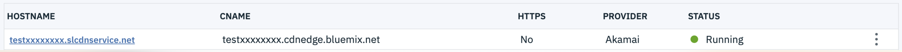
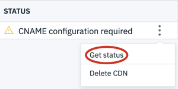
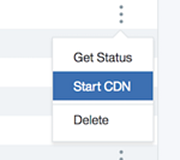
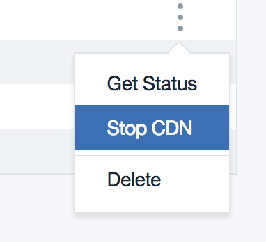
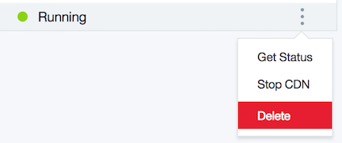

---

copyright:
  years: 2018, 2019
lastupdated: "2019-05-21"

keywords: running status, additional steps, stop cdn, learn, configure cname, delete cdn, start cdn

subcollection: CDN

---

{:shortdesc: .shortdesc}
{:new_window: target="_blank"}
{:codeblock: .codeblock}
{:pre: .pre}
{:screen: .screen}
{:tip: .tip}
{:note: .note}
{:important: .important}
{:warning: .warning}
{:download: .download}

# Getting your CDN to Running Status
{: #getting-your-cdn-to-running-status}

Learn how to get your CDN to a RUNNING state by following these guidelines. This document also tells you how to start and stop your CDN.

## Get to Running
{: #get-to-running}

Once you've created a CDN, it appears on your CDN dashboard. Here you'll see the name of your CDN, the Origin, the Provider, and the status.  

 

If you ordered your CDN with HTTP or HTTPS with Wildcard certificate, you can proceed to Step 1.

If you created a CDN with HTTPS DV SAN certificate, additional steps may be needed to verify your domain and can be found on the [Completing Domain Control Validation for HTTPS](/docs/infrastructure/CDN?topic=CDN-completing-domain-control-validation-for-https-with-dv-san#completing-domain-control-validation-for-https) page.

**Step 1:**

After you've ordered a CDN, you'll need to configure the **CNAME** with your DNS provider. Most DNS providers can give you instructions on setting or changing the CNAME.

   * During this time, your CDN's status will show as **CNAME Configuration**. Check with your DNS provider to find out when the changes will become active.

     

**Step 2:**

Any time after you've configured the CNAME with your DNS provider, you may check the status by selecting **Get Status** from the overflow menu to the right of the CDN's status.

    

**Step 3:**

When the CNAME chaining is complete, selecting **Get Status** will change the status to *RUNNING*, and the CDN is ready to use.

Congratulations! Your CDN is now running. From here, the [Manage your CDN](/docs/infrastructure/CDN?topic=CDN-manage-your-cdn#manage-your-cdn) page has additional information on configuring options, such as [Time to Live](/docs/infrastructure/CDN?topic=CDN-manage-your-cdn#setting-content-caching-time-using-time-to-live-), [Purging Cached Content](/docs/infrastructure/CDN?topic=CDN-manage-your-cdn#purging-cached-content), and [Adding Origin Path details](/docs/infrastructure/CDN?topic=CDN-manage-your-cdn#adding-origin-path-details).

## Starting CDN
{: #starting-cdn}

Starting your CDN informs the DNS to direct traffic from your origin to the Akamai edge server. Once the mapping is started, the DNS cache may still direct traffic to the origin so the functionality may not be seen by the domain immediately after the mapping is started. The time it takes to update depends on how often the DNS cache is refreshed, and varies depending on your DNS provider.

A CDN can be started only when it is in `Stopped` status.
{: note}

**Step 1:**

Click **Start CDN** from the Overflow menu, which appears as three dots to the right side of the CDN row.

  

**Step 2:**

A larger dialog window appears, asking to confirm that you want to start the service. Select **Confirm** to proceed.

**Step 3:**

If the action was successful, a dialog box appears in the upper right corner of your screen, letting you know that it was successful, along with the time.

**Step 4:**

This step changes the Status to `CNAME Configuration`

**Step 5:**

Click **Get Status** from Overflow menu. This step changes the status to `Running`. Your CDN becomes operational.

## Stopping a CDN
{: #stopping-a-cdn}

STOP CDN functionality is intended for maintenance windows not exceeding 7 days. After 7 days, the CDN must be started, or it will be disabled, and traffic to the CDN CNAME will not be redirected to the origin server.
{: important}

Once a mapping is stopped, the DNS lookup is switched to the origin. Traffic skips the CDN edge servers and content is fetched directly from the origin. After a mapping is stopped, there may be a brief period of time where your content is not accessible. This is because the DNS cache may still be directing traffic to the Akamai edge servers. However, during this time, the Akamai edge server will deny traffic for the domain. How long this period lasts depends on how often the DNS cache is refreshed, and varies depending on your DNS provider.

A CDN can be stopped only when in `Running` state.
{: note}

Stopping a CDN is **NOT** recommended for a CDN configured with an HTTPS SAN Certificate, because HTTPS traffic may not work when you move the CDN back to `Running` status.
{: important}

Stopping a CDN for a Wildcard domain is **NOT** allowed at this time.
{: important}

**Step 1:**

Click 'Stop CDN' from the Overflow menu (3 vertical dots to the right of the CDN status).
  

**Step 2:**

A larger dialog window appears, asking you to confirm that you want to stop the service. Select **Confirm** to proceed.

**Step 3:**

After about 5 to 15 seconds, the status should change to 'Stopped'

## Deleting a CDN
{: #deleting-a-cdn}

To delete a CDN follow these steps:

Selecting `Delete` from the overflow menu only deletes the CDN; it does not delete your account.
{: note}

**Step 1:**

Click 'Delete' from the overflow menu.

 

**Step 2:**

A larger dialog window appears, asking to confirm that you want to delete. Click **Delete** to proceed.

If your CDN is configured using HTTPS with DV SAN Certificate, it may take up to 5 hours to complete the delete process.
{: note}

  

**Step 3:**

After completing steps 1 and 2, your CDN's status will be `Deleting`. When the delete process is complete, click 'Get Status' from the overflow menu again to remove the row from the CDN list. If the delete process has not completed, this action will have no effect.
