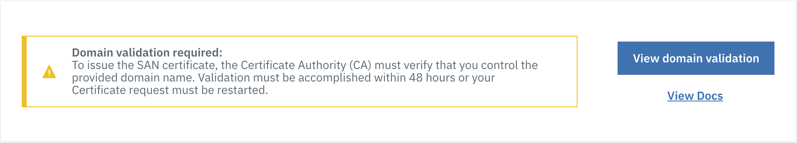

---

copyright:
  years: 2018, 2024
lastupdated: "2024-10-09"

keywords: https, san certificate, apache, nginx, redirect

subcollection: CDN

---

{{site.data.keyword.attribute-definition-list}}

# Completing Domain Control Validation for HTTPS with DV SAN
{: #completing-domain-control-validation-for-https-with-dv-san}
{: help}
{: support}

Complete the following steps after ordering your CDN with a DV SAN certificate.
{: shortdesc}

The following diagram outlines the various states that your CDN enters, from the time it is created until it gets to `Running` status.

{: caption="SAN state" caption-side="bottom"}

## Initial steps to Domain Control Validation
{: #initial-steps-to-domain-control-validation}

Complete these steps:

1. After you've ordered your CDN with a DV SAN certificate, the certificate requesting process begins. During this process, {{site.data.keyword.cloud}} CDN requests a certificate from Akamai. After a certificate becomes available, Akamai issues a request to the certificate authority (CA).

   During this time, the CDN status shows as `Requesting certificate`.

2. After the CA receives the request, it issues a Domain Validation Challenge.

   When this happens, your CDN's status changes to `Domain validation required`.

3. Click the name of the CDN that must be validated. The Overview page opens, where you can see the overall status of your CDN. At the top of the page, an alert appears, reminding you that domain validation is needed. Select the **View domain validation** button to open a window that shows you the challenge information that you need to complete the validation process.

   {: caption="Figure 1: Domain validation required" caption-side="bottom"}

4. After you've completed one of the validation steps from the section on how to address a Domain Validation Challenge, your CDN moves into **Deploying certificate** status. During this time, Akamai distributes your validated certificate to their edge servers. Deploying a certificate can take 2 - 4 hours.

   When this process is complete, all domains, regardless of the validation method used, move into a **CNAME configuration required** state.

## Domain Control Validation
{: #domain-control-validation}

To get your CDN domain name added to the SAN certificate, you must prove that you have administrative control over your domain. This process of proof is referred to as addressing the Domain Control Validation (DCV). You must address the DCV within 48 hours. If you fail to do so, your request expires, and you must begin the order process again. The four different ways to address DCV are described in the sections that follow.

### CNAME
{: #cname}

This method is recommended **ONLY** if your CDN is not serving live traffic. If your domain is serving live traffic, it is recommended to use one of the other three methods to validate your domain.

To use this method, add a CNAME record for your CDN domain into your DNS configuration. The [IBM CNAME](/docs/CDN?topic=CDN-next-steps-after-ordering#ibm-cname) can be used as the record value. No other action is required by you. The DCV progresses automatically from this point. Validation can take 2 - 4 hours. After the certificate is deployed, your CDN moves directly to `Running` status.

For the CDN domain `cdn.example.com`, you can add a CNAME type record to point this domain to IBM CNAME:

| Resource Type | Host | Points to (CNAME) | TTL |
|------------------|---------|-------------|----------------|
| *CNAME* | *cdn.example.com* | *example.cdn.appdomain.cloud.* | *15 minutes* |
{: caption="Add CNAME type record to point to CNAME" caption-side="bottom"}

---

### Challenge domain
{: #challenge-domain}

The challenge domain is a new domain, specific for your CDN domain. By setting a CNAME record in your DNS system for the challenge domain, CA can also validate your CDN domain. If you choose this method, you don't need to change the CDN domain's record, therefore it has no effect on the traffic if your domain is running service.

The Challenge domain format is: `_acme-challenge.<CDN domain>`
The Challenge CNAME format is: `<CDN domain>.ak-acme-challenge.cdn.appdomain.cloud.`

For example, the CDN domain is `cdn.example.com`, then the challenge domain CNAME record would be:

| Resource Type | Host | Points to (CNAME) | TTL |
|------------------|---------|-------------|----------------|
| *CNAME* | *_acme-challenge.cdn.example.com* | *cdn.example.com.ak-acme-challenge.cdn.appdomain.cloud.* | *15 minutes* |
{: caption="Challenge domain CNAME" caption-side="bottom"}

Using the challenge domain validation method can keep your domain always active in the certificate even after you migrate the CDN domain to others. When using other methods, you would receive an [email alert](/docs/CDN?topic=CDN-faq-for-https#i-received-an-email-indicating-that-my-domain-is-not-pointed-to-IBM-CDN-CNAME) after you migrate to others.
{: note}

---

### Standard
{: #standard}

If you choose the Standard method for domain validation, the Domain Validation window shows a **Challenge URL** and a **Challenge response**. To complete the domain validation process, add the provided **Challenge response** to your origin server. After it is added, the CA can retrieve the **Challenge response** from your origin server using the URL specified in the **Challenge URL**. After your origin server is configured correctly, domain validation can take 2 - 4 hours.

To successfully complete the domain validation through the Standard method, you must configure your origin server in a particular way. The example procedures for Apache and Nginx servers are outlined here.

Example situation:

* Origin server: `origin.example.com`
* CDN domain: `cdn.example.com`
* Challenge URL: `http://cdn.example.com/.well-known/acme-challenge/examplechallenge-fileobject`
* Challenge Response: `examplechallenge`

#### Configuring Apache
{: #apache-configuration}

To configure Apache, follow these steps:

1. Log in to the machine running the Apache2 server.

2. Create the challenge response file for the challenge response under `.well-known/acme-challenge/` in the directory for your website content.  The default location for Apache2 website content is `/var/www/html/`. For this example, the challenge response is placed in the `/var/www/html/.well-known/acme-challenge/` directory.

   ```sh
   mkdir -p /var/www/html/.well-known/acme-challenge && \
   printf "examplechallenge" > /var/www/html/.well-known/acme-challenge/examplechallenge-fileobject
   ```
   {: pre}

3. Optionally, open your Apache2 server configuration file. `/etc/apache2/apache2.conf` and `/etc/apache2/sites-enabled/` are the default locations for configuration files.

4. Optionally, add your CDN domain as an additional **ServerAlias** to the virtual host for your origin.

5. If you modified your Apache2 server configuration, restart the Apache2 server with minimal down time by using the following command:

   ```sh
   apachectl -k graceful
   ```
   {: pre}

6. Create an A record in your DNS between the CDN domain and the origin server's IP address.

#### Configuring Nginx
{: #nginx-configuration}

To configure Nginx, follow these steps:

1. Log in to the machine running the Nginx server.

1. Create the challenge response file for the challenge response under `.well-known/acme-challenge/` in the directory for your website content.  The default location for Nginx website content is `/usr/share/nginx/html/`.  For this example, the challenge response is placed in the `/usr/share/nginx/html/.well-known/acme-challenge/` directory.

    ```sh
    mkdir -p /usr/share/nginx/html/.well-known/acme-challenge && \
    printf "examplechallenge" > /usr/share/nginx/html/.well-known/acme-challenge/examplechallenge-fileobject
    ```
    {: pre}

1. Optionally, open your Nginx server configuration file. `/etc/nginx/nginx.conf` and `/etc/nginx/conf.d/` are the default locations for configuration files.

1. Optionally, add your CDN domain as an additional **server_name** to the server block for your origin.

1. If you modified your Nginx server configuration, restart the Nginx server with minimal down time by using the following command:

    ```sh
    nginx -s reload
    ```
    {: pre}

1. Create an A record in your DNS between the CDN domain and the origin server's IP address.

#### Verify that this Standard method to address domain validation is ready for the CA
{: #verify-that-this-standard-method-to-address-domain-validation-is-ready-for-the-ca}

* To verify this method works through `curl`, run that command for the Challenge URL.

    ```sh
    curl -v http://cdn.example.com/.well-known/acme-challenge/examplechallenge-fileobject
    ```
    {: pre}

* To verify this method works through a browser, attempt to access the Challenge URL from your browser.

In either case, you should be able to retrieve the copy of the Domain Validation Challenge file object stored on your origin server.

#### Cleaning up for the Standard method
{: #clean-up-for-the-standard-method}

After your CDN has reached **Certificate deploying** status:
1. Remove the `examplechallenge-fileobject` file. (optional)
1. Optionally, remove the added ServerAlias (Apache2) or the server_name (Nginx) from your server configuration.
1. Remove the A record between the CDN domain and the origin server IP.

---

### Redirect
{: #redirect}

Clicking the **Redirect** tab displays all the information that is needed to address the Domain Validation through redirect. This information allows the CA to retrieve a copy of the **Challenge response** from Akamai through your origin server. After your server is configured correctly, Domain Validation can take 2 - 4 hours.

To successfully complete the Domain Validation through the Redirect method, you might need to configure your web server in a particular way. The example procedures for Apache and Nginx servers are outlined in the sections that follow.

Example situation:

* Origin server: `origin.example.com`
* CDN domain: `cdn.example.com`
* Challenge URL: `http://cdn.example.com/.well-known/acme-challenge/examplechallenge-fileobject`
* URL Redirect: `http://dcv.akamai.com/.well-known/acme-challenge/examplechallenge-fileobject`

#### Apache redirect configuration
{: #apache-redirect-configuration}

To configure an Apache redirect, follow these steps:

1. Log in to the machine running the Apache2 server.

2. Open your Apache2 server configuration file. `/etc/apache2/apache2.conf` and `/etc/apache2/sites-enabled/` are the default locations for the configuration file.

3. Add a redirect statement in the appropriate location within the configuration file. If needed, add your CDN domain as an additional **ServerAlias** to the virtual host for your origin.

    ```sh
    Redirect /.well-known/acme-challenge/examplechallenge-fileobject http://dcv.akamai.com/.well-known/acme-challenge/examplechallenge-fileobject
    ```

4. Restart the Apache2 server with minimal downtime by using the following command:

    ```sh
    apachectl -k graceful
    ```
    {: pre}

5. Create an A record in your DNS between the CDN domain and the origin server's IP address.

#### Nginx redirect configuration
{: #nginx-redirect-confguration}

To configure an Nginx redirect, follow these steps:

1. Log in to the machine running the Nginx server.

2. Open your Nginx server configuration file. `/etc/nginx/nginx.conf` and `/etc/nginx/conf.d/` are the default locations for the configuration files.

3. There are two equally valid methods for this step.

   * Option 1: (recommended) Add a `location` block with a `return` directive to perform the redirect within the appropriate `server` block. If needed, add your CDN domain as an additional **server_name** to the server block for your origin.

      ```sh
       server {
         listen 80;
         server_name origin.example.com cdn.example.com;

         # Some server configuration directives
         # ...

         location = /.well-known/acme-challenge/examplechallenge-fileobject  {
             return 302 http://dcv.akamai.com$request_uri;
         }

         # Some more server configuration directives
         # ...
       }
       ```

   * Option 2: Add a `rewrite` directive within the `server` block. If needed, add your CDN domain as an additional **server_name** to the server block for your origin.

       ```sh
       server {
         listen 80;
         server_name origin.example.com cdn.example.com;

         # Some server configuration directives
         # ...

         rewrite ^/(\.well-known/acme-challenge/examplechallenge-fileobject)$ http://dcv.akamai.com/$1 redirect;

         # Some more server configuration directives
         # ...
       }
       ```

4. Restart the Nginx server with minimal downtime by using the following command:

   ```sh
    nginx -s reload
    ```
    {: pre}

5. Create an A record in your DNS between the CDN domain and the origin server's IP address.

#### Verify that the redirect is occurring
{: #verify-that-the-redirect-is-occurring}

Completing these steps redirects **only** the traffic for the specific Challenge URL to the URL Redirect. You can verify that the redirect worked either through `curl` or through the browser.

* To verify that redirect works through `curl`, run that command for the Challenge URL.

    ```sh
    curl -vL http://cdn.example.com/.well-known/acme-challenge/examplechallenge-fileobject
    ```

* To verify that redirect works through the browser, attempt to reach the Challenge URL from your browser.

In either case, you should be able to retrieve the copy of the Domain Validation Challenge file object from Akamai at the `dcv.akamai.com` domain, to which the original request was redirected.

#### Clean up for the Redirect method
{: #clean-up-for-the-redirect-method}

After your CDN indicates **Certificate deploying** status, you can:
1. (Optional) Remove the redirect statements or blocks from the configuration file.
1. (Optional) Remove the added ServerAlias (Apache2) or the server_name (Nginx) from your server configuration, if needed.
1. Remove the A record between the CDN domain and the origin server IP.

## Next steps
{: #cdn-next-steps1}

Continue following instructions in [Getting to Running status](/docs/CDN?topic=CDN-next-steps-after-ordering).
