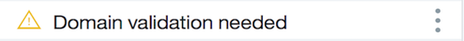
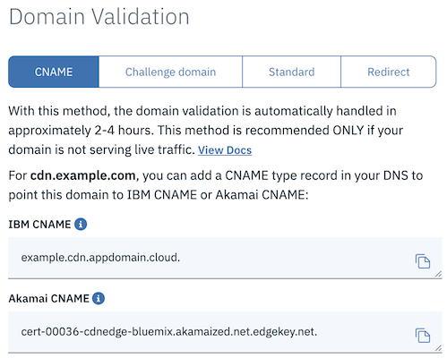
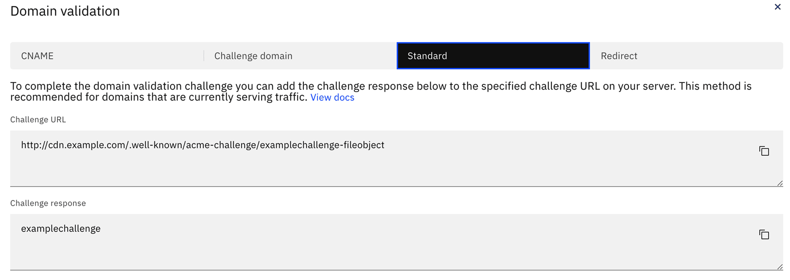
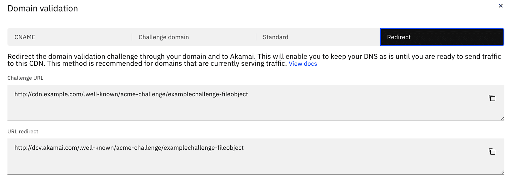

---

copyright:
  years: 2018
lastupdated: "2018-06-17"

---

{:shortdesc: .shortdesc}
{:new_window: target="_blank"}
{:codeblock: .codeblock}
{:pre: .pre}
{:screen: .screen}
{:tip: .tip}
{:download: .download}

# Completing Domain Control Validation for HTTPS

## Initial steps to Domain Control Validation

**Step 1:**

After you've ordered your CDN with a DV SAN Certificate, the certificate requesting process begins. During this process, IBM Cloud CDN requests a certificate from Akamai. Once a certificate becomes available, Akamai issues a request to the Certificate Authority (CA).

  * During this time, the CDN status will show as **Requesting Certificate**.

    

**Step 2:**

Once the CA receives the request, it will issue a Domain Validation Challenge.

  * When this happens, your CDN's status will change to **Domain validation needed**.

    

**Step 3:**

Click on the name of the CDN that needs to be validated. The Overview page opens, where you can see the overall status of your CDN. At the top of the page is an alert reminding you that domain validation is needed. Select the **View domain validation** button to open a window that shows you the challenge information needed to complete the validation process.

   

**Step 4:** Once you have completed one of the validation steps from the section on how to address a Domain Validation Challenge, your CDN moves into **Deploying certificate** status. During this time, Akamai will distribute your validated certificate to their edge servers. Deploying a certificate can take 2 to 4 hours.

  * When this process is complete, all domains, regardless of the validation method used, move into a **CNAME Configuration** state.

Additional information regarding completion of CNAME Configuration, as well as overseeing your CDN can be found on the [Getting to Running](basic-functions.html#get-to-running) page.


## Domain Validation Challenge

The Domain Validation Challenge proves that you are the owner of the domain. Below are three ways you can address the Domain Validation Challenge.

**NOTE**: If you do not respond to the Domain Validation request within 48 hours, your request will expire, and you will need to begin the order process again.

### CNAME

If your CNAME record was added to your DNS provider before ordering your CDN, you don't need to do anything else. The Domain Validation is automatically handled by IBM Cloud, Akamai, and the CA. Validation can take 2 to 4 hours.

  * If you have not yet configured your CNAME with your DNS provider, you need to do so at this time. Most DNS providers can give you instructions on setting or changing the CNAME.

   

**NOTE**: This method is recommended **ONLY** if your CDN is **not** serving live traffic. If your domain is serving live traffic, it is recommended to use the Standard method to validate your domain.

---
### Standard

If you choose the Standard method for Domain Validation, the Domain Validation window shows a **Challenge URL** and a **Challenge response**. To complete the Domain Validation process, you must add the provided **Challenge response** to your origin server. This allows the CA to retrieve the **Challenge response** from your origin server using the URL specified in the **Challenge URL**. After your origin server is configured correctly, Domain Validation can take 2 to 4 hours.

   

To successfully complete the Domain Validation through the Standard method, you need to configure your origin server in a particular way. The example procedures for Apache and Nginx servers are outlined below.

**Example situation**
* Origin server: `www.example.com`
* CDN domain: `cdn.example.com`
* Challenge URL: `http://cdn.example.com/.well-known/acme-challenge/examplechallenge-fileobject`
* Challenge Response: `examplechallenge`

#### Apache Configuration

  * **Step 1:** Log into the machine running the Apache2 server.

  * **Step 2:** Create the challenge response file for the challenge response under `.well-known/acme-challenge/` in the directory for your website content.  The default location for Apache2 website content is `/var/www/html/`. For this example, the challenge response would be placed in the `/var/www/html/.well-known/acme-challenge/` directory.

      ```
      mkdir -p /var/www/html/.well-known/acme-challenge
      printf "examplechallenge" > /var/www/html/.well-known/acme-challenge/examplechallenge-fileobject
      ```

  * **Step 3:** If needed, open your Apache2 server configuration file. `/etc/apache2/apache2.conf` and `/etc/apache2/sites-enabled/` are the default locations for configuration files.

  * **Step 4:** If needed, add your CDN domain as an additional **ServerAlias** to the virtual host for your origin.

  * **Step 5:** If you had to modify your Apache2 server configuration, restart the Apache2 server with minimal downtime by using the following command:

      ```
      apachectl -k graceful
      ```

  * **Step 6:** Create an A record in your DNS between the CDN domain and the origin server's IP address.

#### Nginx Configuration

  * **Step 1:** Log into the machine running the Nginx server.

  * **Step 2:** Create the challenge response file for the challenge response under `.well-known/acme-challenge/` in the directory for your website content.  The default location for Nginx website content is `/usr/share/nginx/html/`.  For this example, the challenge response would be placed in the `/usr/share/nginx/html/.well-known/acme-challenge/` directory.
      ```
      mkdir -p /usr/share/nginx/html/.well-known/acme-challenge
      printf "examplechallenge" > /usr/share/nginx/html/.well-known/acme-challenge/examplechallenge-fileobject
      ```

  * **Step 3:** If needed, open your Nginx server configuration file. `/etc/nginx/nginx.conf` and `/etc/nginx/conf.d/` are the default locations for configuration files.

  * **Step 4:** If needed, add your CDN domain as an additional **server_name** to the server block for your origin.

  * **Step 5:** If you had to modify your Nginx server configuration, restart the Nginx server with minimal downtime by using the following command:

      ```
      nginx -s reload
      ```

  * **Step 6:** Create an A record in your DNS between the CDN domain and the origin server's IP address.

#### Verify that this Standard method to address Domain Validation is ready for the CA

* To verify this method works through `curl`, execute that command for the Challenge URL.
    ```
    curl -v http://cdn.example.com/.well-known/acme-challenge/examplechallenge-fileobject
    ```
* To verify this method works through a browser, attempt to access the Challenge URL from your browser.

In either case, you should be able to retrieve the copy of the Domain Validation Challenge file object stored on your origin server.

#### Clean-up for the Standard method

After your CDN has reached **Certificate deploying** status:
1. Remove the `examplechallenge-fileobject` file. (optional)
1. Remove the added ServerAlias (Apache2) or the server_name (Nginx) from your server configuration, if needed. (optional)
1. Remove the A record between the CDN domain and the origin server IP.

---
### Redirect

Clicking on the **Redirect** tab displays all the information needed to address the Domain Validation through redirect. This information allows the CA to retrieve a copy of the **Challenge response** from Akamai through your origin server. After your server is configured correctly, Domain Validation can take 2 to 4 hours.

   

To successfully complete the Domain Validation through the Redirect method, you may need to configure your web server in a particular way. The example procedures for Apache and Nginx servers are outlined below.

**Example situation**
* Origin server: `www.example.com`
* CDN domain: `cdn.example.com`
* Challenge URL: `http://cdn.example.com/.well-known/acme-challenge/examplechallenge-fileobject`
* URL Redirect: `http://dcv.akamai.com/.well-known/acme-challenge/examplechallenge-fileobject`

#### Apache Redirect Configuration

  * **Step 1:** Log into the machine running the Apache2 server.

  * **Step 2:** Open your Apache2 server configuration file. `/etc/apache2/apache2.conf` and `/etc/apache2/sites-enabled/` are the default location for the configuration file.

  * **Step 3:** Add a redirect statement in the appropriate location within the configuration file. If needed, add your CDN domain as an additional **ServerAlias** to the virtual host for your origin.
    ```
    Redirect http://cdn.example.com/.well-known/acme-challenge/examplechallenge-fileobject http://dcv.akamai.com/.well-known/acme-challenge/examplechallenge-fileobject
    ```

  * **Step 4:** Restart the Apache2 server with minimal downtime by using the following command:

    ```
    apachectl -k graceful
    ```

  * **Step 5:**
Create an A record in your DNS between the CDN domain and the origin server's IP address.

#### Nginx Redirect Configuration

  * **Step 1:** Log into the machine running the Nginx server.

  * **Step 2:** Open your Nginx server configuration file. `/etc/nginx/nginx.conf` and `/etc/nginx/conf.d/` are the default locations for the configuration files.

  * **Step 3:** There are two equally valid methods for this step.

    * Option 1: (recommended) Add a `location` block with a `return` directive to perform the redirect within the appropriate `server` block. If needed, add your CDN domain as an additional **server_name** to the server block for your origin.

    ```
    server {
      listen 80;
      server_name www.example.com cdn.example.com;

      # Some server configuration directives
      # ...

      location = /.well-known/acme-challenge/examplechallenge-fileobject  {
          return 302 http://dcv.akamai.com$request_uri;
      }

      # Some more server configuration directives
      # ...
    }
    ```

   * Option 2: Add a `rewrite` directive within the `server` block. If needed, add your CDN domain  as an additional **server_name** to the server block for your origin.

    ```
    server {
      listen 80;
      server_name www.exmaple.com cdn.example.com;

      # Some server configuration directives
      # ...

      rewrite ^/(\.well-known/acme-challenge/examplechallenge-fileobject)$ http://dcv.akamai.com/$1 redirect;

      # Some more server configuration directives
      # ...
    }
    ```

  * **Step 4:** Restart the Nginx server with minimal downtime by using the following command:

    ```
    nginx -s reload
    ```

  * **Step 5:** Create an A record in your DNS between the CDN domain and the origin server's IP.

#### Verify that the redirect is occurring

Completing these steps will redirect only the traffic for the specific Challenge URL to the URL Redirect. You can verify that the redirect worked appropriately either through `curl` or the browser.

* To verify that redirect works through `curl`, execute that command for the Challenge URL.

    ```
    curl -vL http://cdn.example.com/.well-known/acme-challenge/examplechallenge-fileobject
    ```

* To verify that redirect works through the browser, attempt to access the Challenge URL from your browser.

In either case, you should be able to retrieve the copy of the Domain Validation Challenge file object from Akamai at the dcv.akamai.com domain, to which the original request was redirected.

#### Clean-up for the Redirect method

After your CDN has reached **Certificate deploying** status:
1. Remove the redirect statements or blocks from the configuration file. (optional)
1. Remove the added ServerAlias (Apache2) or the server_name (Nginx) from your server configuration, if needed. (optional)
1. Remove the A record between the CDN domain and the origin server IP.
