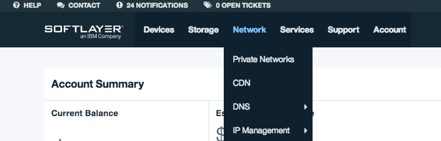
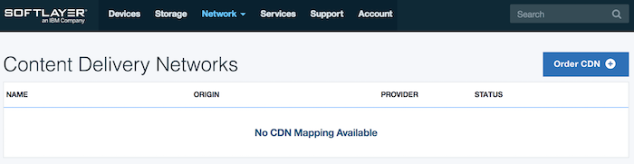
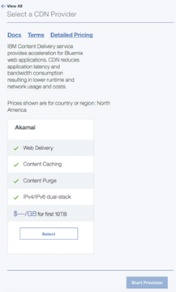
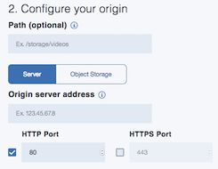
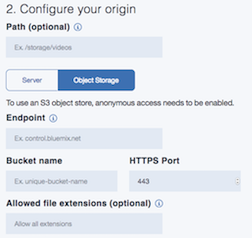
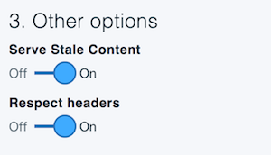

---

copyright:
  years: 2017
lastupdated: "2017-09-10"

---

{:shortdesc: .shortdesc}
{:new_window: target="_blank"}
{:codeblock: .codeblock}
{:pre: .pre}
{:screen: .screen}
{:tip: .tip}
{:download: .download}

# Order a CDN

Here you'll learn how to order a Content Delivery Network (CDN). Your CDN can be ordered either from the [Customer Portal ](https://control.softlayer.com/) or the [Bluemix Portal](https://www.ibm.com/cloud-computing/bluemix/).

## From the Control Portal:

1. To begin, log on to the [Customer Portal ](https://control.softlayer.com/) using your unique credentials.

2. From the navigation bar at the top of the display, select **Network -> CDN**.

   

3. On the **Content Delivery Networks** page, select the **Order CDN** button in the top right corner.

	

## From the Bluemix Portal:

1. Log on the [Bluemix Portal](https://www.ibm.com/cloud-computing/bluemix/)

2. Click on [IBM Bluemix Catalog](https://console.bluemix.net/catalog/). From the left-hand navigation bar, select **Network**.

   

3. Click on the **CDN Tile**, which takes you to the Vendor Selection screen.

   

4. From the **Select a CDN Provider** screen, choose among the CDN provider options. Click the **Selected** button at the bottom of the screen to confirm your selected options, then click **Start Provision**, to start the provisioning process.

	
	
5. Fill out the **Configure Name** field: 
      * Specify the _hostname_ (**required**), which serves as the primary identifier for your CDN (for example, _example.testingcdn.net_).
      * Optionally, you may provide a custom _CNAME_ (such as _myfirstcdn.cdnedge.bluemix.net_). If no CNAME is provided, one will be created for you. <validation information to be included here>
      
      

**Note**: Use of an inappropriate CNAME may lead to termination of services. 

6. Fill out the **Configure Your Origin** field: To configure this field, you must select either the **Server** or the **Object Storage** option. (Specifying the **Path** is optional. <validation information>)
		
  * **The Server Option**: If you select the **Server** option, enter the hostname or IP address of the Origin Server from which data should be cached. 
      * You must specify the **Origin Server Address** (hostname or IPv4 address of the Origin Server) if you select this option.
      * You may also provide an **HTTP port**, an **HTTPS port**, or both. These fields indicate which protocol and port number can be used to contact the Origin Server. For non-default port numbers, please refer to [the FAQ](faq.md) for a list of allowed port numbers.

	   
		
  * **The Object Storage Option**: If you select the **Object Storage** option, you must provide the following information:
      * the **Endpoint** from which to fetch the Object,
      * the name of the **Bucket** in which your content is stored, and
      * the **HTTPS port**.
      * You also may specify the file extensions, separated by commas, that can be used in the CDN service.(If no file name extensions are specified, all file extensions are allowed.)
      * You must set the **Access Control List** (ACL) for each **Object** in your **Bucket** to "public-read".
		
	   

7. Configure the **Other Options** field: This section contains configuration options for the **Serve Stale Content** field and the **Respect Headers** field.
    
     * The **Serve Stale Content** field: **Serve Stale Content** is a Boolean value that indicates whether to serve cached content that has expired, in case the origin server cannot be reached. Because of a current limitation, **Serve Stale Content** functionality is enabled by default, regardless of whether a user sets it to **On** or **Off**.
     * The **Respect Headers** field: When the **Respect Headers** option is **On**, the TTL settings defined in header by the Origin will override the default CDN TTL. **Respect Headers** is set to **On** by default, but you must configure this field.

		
		
8. Select the **Create** button in the bottom right corner to create your CDN.
