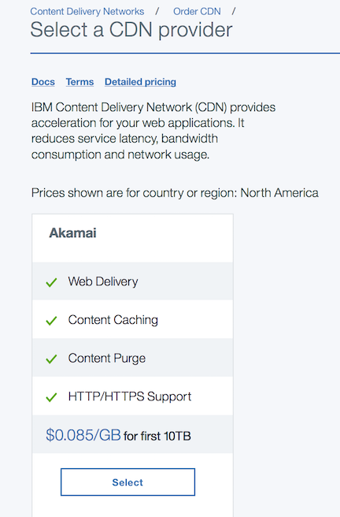
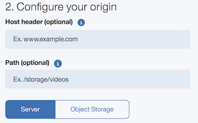
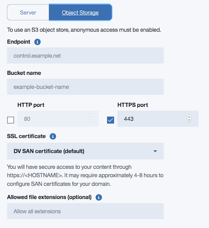
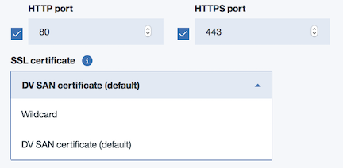

---

copyright:
  years: 2017,2018
lastupdated: "2018-06-28"

---

{:shortdesc: .shortdesc}
{:new_window: target="_blank"}
{:codeblock: .codeblock}
{:pre: .pre}
{:screen: .screen}
{:tip: .tip}
{:download: .download}

# Order a CDN

Here you'll learn how to order a Content Delivery Network (CDN). Your CDN can be ordered from the [IBM Cloud Portal](https://www.ibm.com/cloud-computing/bluemix/).

## Navigating to the CDN page:

**Step 1:**

Log in to your account from the [IBM Cloud Portal](https://www.ibm.com/cloud-computing/bluemix/)

**Step 2:**

Click on [IBM Cloud Catalog](https://console.bluemix.net/catalog/). From the left-hand navigation bar, select **Network**.

   

**Step 3:**

Click on the **CDN Tile**.

   

## Order a new CDN:

**Step 1:**

Select **Create** at the bottom right, which takes you to the Vendor Selection screen.

   

**Step 2:**

From the **Select a CDN Provider** screen, choose among the CDN provider options. Click the **Select** button to confirm your selected options, then click **Next** at the bottom right of your screen, to start the provisioning process.  
       

**Step 3:**

Fill out the **Configure Name** field:  

  * Specify the **Hostname** (**required**), which serves as the primary identifier for your CDN (for example, `example.testingcdn.net`).  
  * Optionally, you may provide a custom **CNAME** (such as `myfirstcdn.cdnedge.bluemix.net`). If no CNAME is provided, one will be created for you.  

         

    **Note**: Use of an inappropriate CNAME may lead to termination of services.

**Step 4:**

Fill out the **Configure Your Origin** field: To configure this field, you must select either the **Server** or the **Object Storage** option.  

   * Specify the **Host header** (optional). If one is not provided, it will default to the **Hostname**. Please see the feature description for [Host header support](feature-descriptions.html#host-header-support) for more information about the Host header.  

   * Provide a **Path** (optional). The Path should be relative to the **Hostname**.

        

  * **The Server Option**: If you select the **Server** option, enter the hostname or IP address of the Origin Server from which data should be cached.
      * You must specify the **Origin Server Address** (hostname or IPv4 address of the Origin Server) if you select this option. If **HTTPS port** is selected, the **Origin Server Address** must be hostname and not IP address.
      * You may also provide an **HTTP port**, an **HTTPS port**, or both. These fields indicate which protocol and port number can be used to contact the Origin Server. For non-default port numbers, please refer to [the FAQ](faqs.html#are-there-any-restrictions-on-what-http-and-https-port-numbers-are-allowed-for-akamai) for a list of allowed port numbers.
      * **SSL Certificate** This option will appear _only_ when HTTPS Port is selected. \*Additional information for HTTPS and SSL Certificate configurations is following the Object Storage Option description.

	     

  * **The Object Storage Option**: If you select the **Object Storage** option, you must provide the following information:
      * the **Endpoint** from which to fetch the Object,
      * the name of the **Bucket** in which your content is stored, and
      * the **HTTPS port**.
      * **SSL Certificate** This option will appear _only_ when HTTPS Port is selected. \*Additional information for HTTPS and SSL Certificate configurations is following the Object Storage Option description.
      * You also may specify the file extensions, separated by commas, that can be used in the CDN service.(If no file name extensions are specified, all file extensions are allowed.)
      * You must set the **Access Control List** (ACL) for each **Object** in your **Bucket** to "public-read".

      	  

  * **SSL Certificate**: If you select **HTTPS Port** for either Server or Object Storage, you can choose **Wildcard** or **DV SAN Certificate** as your **SSL Certificate** option. Both offer  the enhanced security provided by HTTPS.

    * **Wildcard Certificate** allows HTTPS traffic only when using the **CNAME** and requires no further action on your part
    * **DV SAN Certificate** allows HTTPS traffic over your domain, but requires additional steps to verify.

        

**Step 5:**

Configure the **Other Options** field: This section contains configuration options for the **Respect Headers** field.

   * When the **Respect Headers** option is **On**, the TTL settings defined in header by the Origin will override the default CDN TTL. **Respect Headers** is set to **On** by default, but you must configure this field.  

        

**Step 9:**

Select the **Create** button in the bottom right corner to create your CDN.
