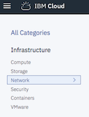
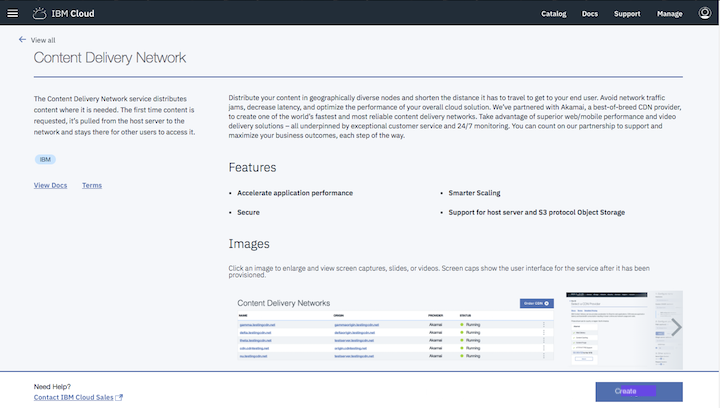
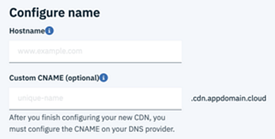
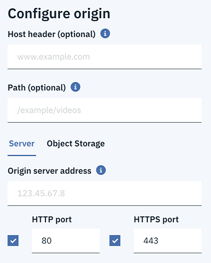
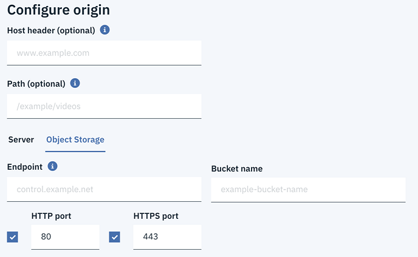

---

copyright:
  years: 2017,2018, 2019
lastupdated: "2019-01-18"

---

{:shortdesc: .shortdesc}
{:new_window: target="blank"}
{:codeblock: .codeblock}
{:pre: .pre}
{:screen: .screen}
{:tip: .tip}
{:download: .download}

# Order a CDN

Here you'll learn how to order a Content Delivery Network (CDN). Your CDN can be ordered from the [{{site.data.keyword.cloud}} Portal](https://cloud.ibm.com/login).

## Navigating to the CDN page:

**Step 1:**

Log in to your account from the [IBM Cloud Portal](https://cloud.ibm.com/login)

**Step 2:**

Click on [IBM Cloud Catalog](https://cloud.ibm.com/catalog/). From the left-hand navigation bar, select **Network**.

   

**Step 3:**

Click on the **CDN Tile**.

   

## Order a new CDN:

**Step 1:**

Click **Create** at the bottom right, which creates your CDN account if you don't have one already and redirects you to the CDN Configure screen.

   

**Step 2:**

Fill out the **Configure Name** field:  

  * Specify the **Hostname** (**required**), which serves as the primary identifier for your CDN (for example, `example.testingcdn.net`).  
  * Optionally, you may provide a custom **CNAME** (such as `myfirstcdn.cdnedge.bluemix.net`). If no CNAME is provided, one will be created for you. The suffix `cdnedge.bluemix.net` is automatically appended to the CNAME. Use of an inappropriate CNAME may lead to termination of services.

         

    **Note**: After provisioning your new CDN, you **must** configure the CNAME with your DNS provider.

**Step 3:**

Fill out the **Configure Your Origin** field: To configure this field, you must select either the **Server** or the **Object Storage** option.  

  * **Step 3, Option 1: The Server Option**

     

      * You must specify the **Origin Server Address** (hostname or IPv4 address of the Origin Server). If **HTTPS port** is also selected, the **Origin Server Address** must be the hostname and not IP address.

      * Specify the **Host header** (optional). If one is not provided, it defaults to the **Hostname**. Please see the feature description for [Host header support](feature-descriptions.html#host-header-support) for more information about the Host header.  

      * Provide a **Path** where content can be retrieved from on the Origin (optional). Please see the feature description for [Path-based CDN mappings](feature-descriptions.html#path-based-cdn-mappings) to understand the implications of adding a path at this time.

      * You may also provide an **HTTP port**, an **HTTPS port**, or both. These fields indicate which protocol and port number can be used to contact the Origin Server. For non-default port numbers, please refer to [the FAQ](faqs.html#are-there-any-restrictions-on-what-http-and-https-port-numbers-are-allowed-for-akamai-) for a list of allowed port numbers.

      * **SSL Certificate** This option appears _only_ when HTTPS Port is selected. If you select **HTTPS Port** for either Server or Object Storage, you can choose **Wildcard** or **DV SAN Certificate** as your SSL Certificate option. Both offer the enhanced security provided by HTTPS.
        * **Wildcard Certificate** allows HTTPS traffic only when using the **CNAME** and requires no further action on your part
        * **DV SAN Certificate** allows HTTPS traffic over your domain, but requires additional steps to verify. See the [Completing Domain Control Validation for HTTPS](how-to-https.html#completing-domain-control-validation-for-https) page to understand the steps required and time constraints involved with choosing this option.

	     

  * **Step 3, Option 2: The Object Storage Option**

    

      * You **must** specify the **Endpoint** from which to fetch the object.

      * Specify the **Host header** (optional). If one is not provided, it defaults to the **Hostname**. Please see the feature description for [Host header support](feature-descriptions.html#host-header-support) for more information about the Host header.  

      * Provide a **Path** where content can be retrieved from on the Origin (optional). Please see the feature description for [Path-based CDN mappings](feature-descriptions.html#path-based-cdn-mappings) to understand the implications of adding a path here.

      * You **must** provide the name of the **Bucket** in which your content is stored.

      * You may also provide an **HTTP port**, an **HTTPS port**, or both. These fields indicate which protocol and port number can be used to contact the Origin Server. For non-default port numbers, please refer to [the FAQ](faqs.html#are-there-any-restrictions-on-what-http-and-https-port-numbers-are-allowed-for-akamai-) for a list of allowed port numbers.

      * **SSL Certificate** This option appears _only_ when HTTPS Port is selected. If you select **HTTPS Port** for either Server or Object Storage, you can choose **Wildcard** or **DV SAN Certificate** as your SSL Certificate option. Both offer the enhanced security provided by HTTPS.
        * **Wildcard Certificate** allows HTTPS traffic only when using the **CNAME** and requires no further action on your part
        * **DV SAN Certificate** allows HTTPS traffic over your domain, but it requires additional steps to verify. See the [Completing Domain Control Validation for HTTPS](how-to-https.html#completing-domain-control-validation-for-https) page to understand the steps required and time constraints involved with choosing this option.

        

      **NOTE** You must set the **Access Control List** (ACL) for each Object in your Bucket to "public-read" with your cloud object storage provider.
      
**Step 4:**

* You must select **I have read the Master Service Agreement and agree to the terms therein** at the bottom right, above the **Create** button.

* Then select the **Create** button in the bottom right corner to create your CDN.
