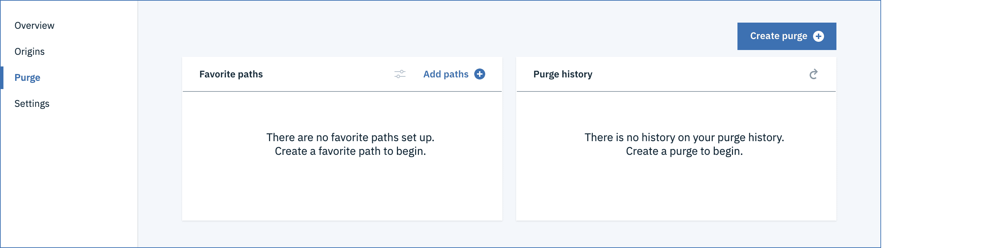
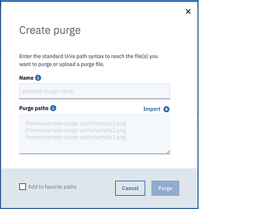
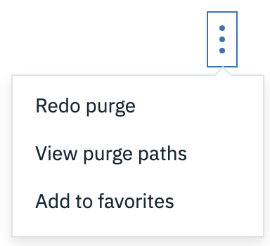

---

copyright:
  years: 2017, 2020
lastupdated: "2020-03-27"

keywords: manage, time to live, origin path, cache key, server, object storage, bucket, configuration, details, updating

subcollection: CDN

---

{:shortdesc: .shortdesc}
{:new_window: target="_blank"}
{:codeblock: .codeblock}
{:pre: .pre}
{:screen: .screen}
{:tip: .tip}
{:note: .note}
{:download: .download}
{:DomainName: data-hd-keyref="DomainName"}
{:help: data-hd-content-type='help'}
{:support: data-reuse='support'}

# Managing your CDN
{: #manage-your-cdn}
{: help}
{: support}

This document describes common tasks for managing your CDN.

## Setting content caching time using "Time To Live"
{: #setting-content-caching-time-using-time-to-live}

After your CDN is running, you can set your content caching time using Time To Live (TTL). The Time To Live for a particular file or directory path indicates how long that content should be cached. When you created the CDN Mapping, a default global TTL of 3600 seconds (1 hour) was created.

To set the content caching time using TTL, follow these steps:

1. On the CDN page, select your CDN, which takes you to the **Overview** page.
2. Adjust the time using the arrows, or by entering a new time. The time value is specified in seconds. For example, 3600 seconds is equal to 1 hour. The smallest value for `timeToLive` that can be chosen is 0 seconds, while the largest is 2147483647 seconds (approximately 24855 days). Select the **Save** button to set the content caching time.

  

3. After saving, you can **Edit** or **Delete** the TTL setting using the Overflow menu options. (**NOTE**: The Path for TTL cannot be changed. If the Mapping path is changed, the TTL path is updated automatically.)

    

  * When the content matches multiple rules, the most recently added configuration takes precedence.

  * TTL values can be set only for a specific file name or directory. Regular expressions are not supported because they might create unpredictable behavior.

## Adding Origin Path details
{: #adding-origin-path-details}

When your CDN is in *CNAME_Configuration* or *Running* status, you can add Origin Path details. You can choose to provide content from multiple
Origin servers. For example, photos can be delivered from a different server than videos. The Origin can be based on a Host Server or Object Storage.

The CDN makes a URL transformation for the origin server. For example, if origin `xyz.example.com` is added with path `/example/*` when a user opens the URL `www.example.com/example/*`, the CDN edge server retrieves the content from `xyz.example.com/*`.
{: note}

1. On the CDN page, select your CDN, which takes you to the **Overview** page.  
2. Select the **Origins** tab, then select the **Add Origin** button. This step opens a new dialog window, where you can configure your Origin.  

   

3. You *must* provide a path. You may optionally provide a host header.  

   

4. Select either **Server** or **Object Storage**.

  * If you selected **Server**, enter the Origin server address as IPv4 address or the _hostname_. It is recommended to provide the hostname and provide a Fully Qualified Domain Name (FQDN). Depending on which protocol you selected during CDN creation, also provide an HTTP port, an HTTPS port, or both. If you use an HTTPS port, the Origin server address **must** be a _hostname_ and not an IP address.

       

  * If you selected **Object Storage**, provide the Endpoint, Bucket name, and HTTPS port. Optionally, specify the file extensions that can be used in the CDN service. If nothing is specified, all file extensions are allowed.

       

  * **Optimization** and **Cache Key** options are the same for the Server and the Object Storage configurations.

    * Choose **Optimization** options from the list menu. **General web delivery** is the default option, or you can choose **Large file** or **Video on Demand** optimizations. **General web delivery** allows the CDN to serve content up to 1.8 GB, while **Large file** optimization allows downloads of files from 1.8 GB to 320 GB. **Video on demand** optimizes your CDN for delivery of segmented streaming formats. The Feature descriptions for [Large file optimization](/docs/CDN?topic=CDN-about-content-delivery-networks-cdn-#large-file-optimization) and [Video on Demand](/docs/CDN?topic=CDN-about-content-delivery-networks-cdn-#video-on-demand) provide further information.

        

    * Choose **Cache Key** options from the list menu. The default option is **Include-all**. If you select **Include specified** or **Ignore specified**, you **must** enter query strings to be included or ignored, separated by a space. For example, enter `uuid=123456` for a single query string, or `uuid=123456 issue=important` for two query strings.  You can find out more about [Cache Key Optimization](/docs/CDN?topic=CDN-about-content-delivery-networks-cdn-#cache-key-optimization) in the feature description.

        

The Protocol and Port options that are shown by the UI match what was selected when you ordered the CDN. For example, if **HTTP port** was selected as part of ordering a CDN, only the **HTTP port** option is shown as part of Add Origin.
{: note}

5. Select the **Add** button to add your Origin Path.

   When you provide file extensions for an Object Storage origin path, the TTL setting with the same URL as the origin path is scoped to include all files that have those specified file extensions. For example, if you create an origin path of `/example` and you specify file extensions of "jpg png gif", the TTL value of the TTL path `/example` will have a scope that includes all JPG/PNG/GIF files under the `/example` directory and its subdirectories.
{: note}

6. After adding, you can Edit**** or **Delete** the Origin using the Overflow menu options.

  

## Purging cached content
{: #purging-cached-content}

When your CDN in [these statuses](/docs/CDN?topic=CDN-faqs#what-status-is-cdn-allowed-for-multiple-file-purge), you can purge the cached contents in multiple paths from the vendor's server.

1. On the CDN page, select your CDN, which takes you to the **Overview** page.
2. Select the **Purge** tab.

   

3. Click the **Create purge** button.
4. Enter standard UNIX path syntax or upload a local purge file to indicate which paths you want to purge, then click the **Purge** button. You can purge multiple paths at a time. See [FAQs for rules and naming conventions](/docs/CDN?topic=CDN-rules-and-naming-conventions#what-are-the-rules-for-the-path-string-for-purge) for more details on what syntax or a local file is allowed for the Purge paths.

   

5. After purging, the group is listed under **Purge history**. If the process succeeds, the cached contents of the path list in the edge server are cleared. If you want to save a group for future use without performing a purge operation, click the **Add paths** button instead.

   

6. With a specified group you can **Redo purge**, **View purge paths**, or **Add to favorites** using the Overflow menu options.

   

   By default, the purge groups in the **Purge history** are not saved to favorites and trimmed every 15 days automatically. To save purge groups for future use, you can save them as favorites by choosing the **Add to favorites** option. When a purge group is saved, it is not be automatically trimmed.

   The name and path list for a purge group that is listed in **Favorite paths** and **Purge history** cannot be updated at present.
{:note}

## Updating CDN configuration details
{: #updating-cdn-configuration-details}

After your CDN is running, you can update CDN configuration details. Follow these steps.

1. On the CDN page, select your CDN, which takes you to the **Overview** page.
2. Select the **Settings** tab. Your CDN configuration details are displayed.

     

   You will only see SSL Certificate if your CDN was configured with HTTPS.
{: note}

   For **Server**, the following fields can be changed:
      * Host header
      * Origin server address
      * HTTP/HTTPS Port
      * Serve Stale Content
      * Respect Headers
      * Optimization options
      * Cache-query    

   For **Object Storage**, the following fields can be changed:
      * Host header
      * Endpoint
      * Bucket name
      * HTTPS Port
      * Allowed file extensions
      * Serve Stale Content
      * Respect Headers
      * Optimization options
      * Cache-query

3. Update the **Origin** or **Other Options** details if needed, then click the **Save** button in the lower right corner to update your CDN configuration details.
