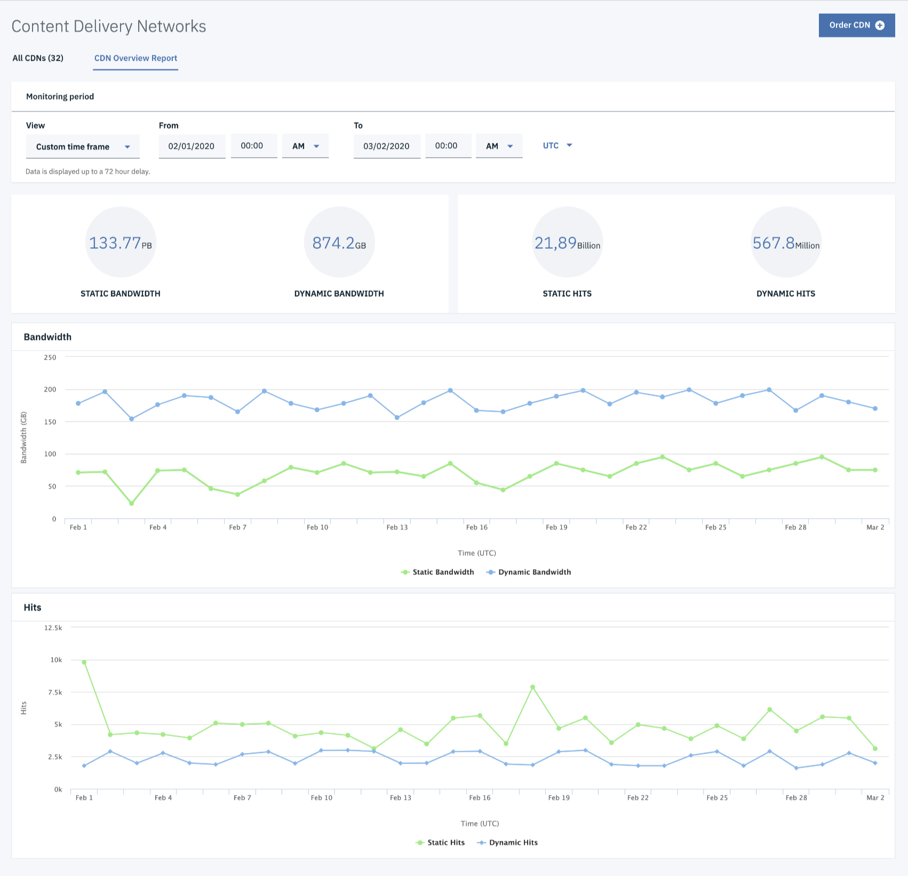
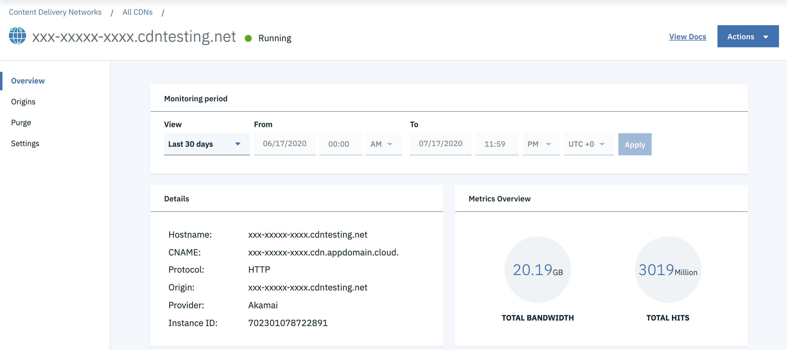
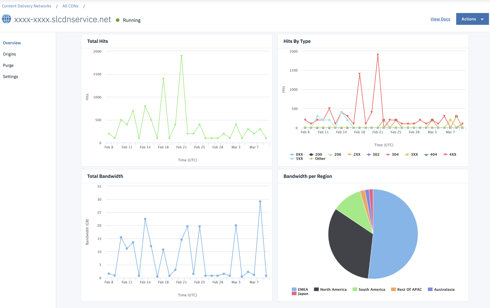
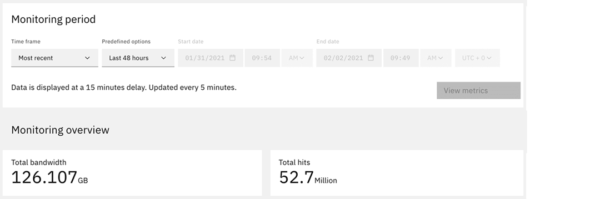
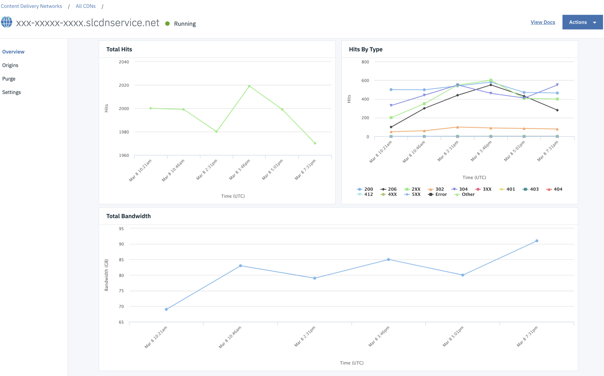
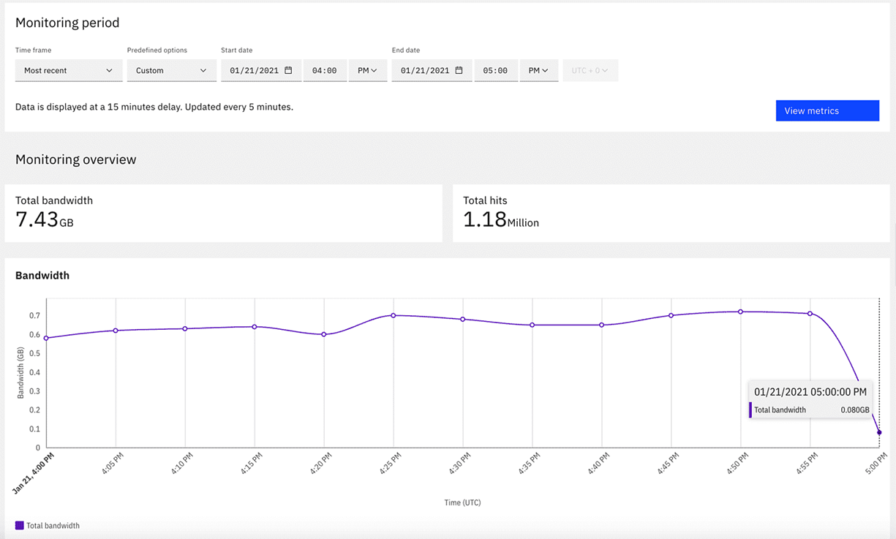

---

copyright:
  years: 2018, 2020
lastupdated: "2020-08-07"

keywords: bandwidth, hit ratio, ingress, hits

subcollection: CDN

---

{:shortdesc: .shortdesc}
{:new_window: target="_blank"}
{:codeblock: .codeblock}
{:pre: .pre}
{:screen: .screen}
{:term: .term}
{:tip: .tip}
{:note: .note}
{:important: .important}
{:deprecated: .deprecated}
{:external: target="_blank" .external}
{:generic: data-hd-programlang="generic"}
{:download: .download}
{:DomainName: data-hd-keyref="DomainName"}

# Viewing metrics
{: #metrics}

The metrics report supports account and CDN-mapping levels with different report types:
{:shortdesc}

|Report level| Report type                | Metrics available|
|------------|----------------------------|------------------|
| Account | [Historical metrics report](#historical-metrics-report)  | Dynamic Bandwidth, Static Bandwidth, Dynamic Hits, Static Hits|
| Account | [Most recent metrics report](#most-recent-metrics-report) | Bandwidth, Hits|
| Mapping | [Historical metrics report](/docs/CDN?topic=CDN-metrics#domain-mapping-historical-metrics-report)  | Bandwidth, Hits, Hit Ratio, Hits By Type, Bandwidth per Region|
| Mapping | [Most recent metrics report](/docs/CDN?topic=CDN-metrics#domain-mapping-most-recent-metrics-report) | Bandwidth, Hits, Hits By Type|

## Metrics report for account
{: #metrics-report-for-account}

To view the metrics reports for account, open the **CDN Overview Report** page next to the **All CDNs** page.

### Historical metrics report
{: #historical-metrics-report}

You can view the overall metric reports over a custom time period. Select **Custom time frame** from the **View** list on the CDN Overview Report page. Here you can find the total **Static Bandwidth**, **Dynamic Bandwidth**, **Static Hits**, **Dynamic Hits** and **Hit Ratio**, as well as a graphical representation of **Static Bandwidth**, **Dynamic Bandwidth**, **Static Hits**, and **Dynamic Hits**.

 

The maximum number of days that you can view metrics reports is 90 days. The latest date that you can view metrics reports is 3 days ago. Start and end time for the historical time range is fixed.
{:note}

### Most recent metrics report
{: #most-recent-metrics-report}

You can view the overall metric reports for a recent time. Select **Most recent** from the **View** list on the CDN Overview Report page. Here you can find the total **Bandwidth** and **Hits**, as well as a graphical representation of **Bandwidth** and **Hits**.

 

You can view data for the past 48 hours only.
{:note}

## Metrics report for domain mapping
{: #metrics-report-for-domain-mapping}

You can view the metrics reports for domain mapping by opening the Overview page. To open the Overview page, click the domain-mapping hostname on the All CDNs page.

### Historical metrics report
{: #domain-mapping-historical-metrics-report}

You can see the **Total Bandwidth** and **Total Hits** for the selected time period (default is the last 30 days) on the Overview page. Other items, such as **Last 90/7/1 days** and **Custom timeframe** are available in the **View** list.

  

On the Overview page, you can find a graphical representation of the **Total Bandwidth**, **Bandwidth per Region**, **Total Hits**, and **Hits By Type** metrics.

  

The maximum number of days that you can view metrics reports is 90 days. Start and end time for the historical time range is fixed.
{: note}

### Most recent metrics report
{: #domain-mapping-most-recent-metrics-report}

Select **Most recent** from the **View** list on the Overview page. Here you can see the **Total Bandwidth**, **Total Hits** for the selected time period *Most recent*.

  

You can also find a graphical representation of **Total Bandwidth**, **Total Hits**, and **Hits By Type**.

  

You can view data for the past 48 hours only.
{:note}

## FAQs for metrics report
{: #faqs-for-metrics-report}

### Is there a minimum number of days for which I can view metrics? Is there a maximum?
{: #min-number-days-for-which-i-can-view-metrics}
{: troubleshoot}

There is a minimum and maximum number of days for which you can view metrics by using {{site.data.keyword.cloud}} Content Delivery Network with Akamai. Historical metrics can be gathered for a minimum of 1 day and a maximum of 90 days. Most recent metrics can be gathered for a minimum of 1 minute and a maximum of 48 hours.

### Why is the hit ratio nonzero when total hits are zero?
{: #why-is-the-hit-ratio-nonzero-when-total-hits-are-zero}
{: troubleshoot}

Hit ratio represents the percentage of times the content was delivered from the Edge server cache, rather than being delivered from the origin server. It is calculated as follows:

`((Edge hits - Ingress hits)/Edge hits) * 100`

Where:

_Edge hits_ specifies all hits to the Edge servers from the users.
_Ingress hits_ specifies origin or ingress hits for traffic from your origin server to Akamai Edge servers.

Because Hit Ratio is calculated at the account level and not per CDN, the Hit Ratio is the same for all the CDNs in your account. This fact also explains why the Hit Ratio might be nonzero when the number of Edge hits for a particular CDN is zero.

### Are metrics updated in real time?
{: #are-metrics-updated-in-real-time}
{: troubleshoot}

The most recent metrics can be updated every 5 minutes, while other metrics are updated every 24 hours.

### What is the time interval when you select **Most recent** from the **View** list?
{: #what-is-the-time-interval-when-you-select-most-recent-item}
{: troubleshoot}

The time range and time interval relationships are shown.

|Time range| Time interval (minutes)   |
|-----------------|--------------------|
|(0, 60]          | 1  |
|(60, 300]        | 5  |
|(300, 600]       | 10 |
|(600, 900]       | 15 |
|(900, 1200]      | 20 |
|(1200, 1500]     | 25 |
|(1500, 1800]     | 30 |
|(1800, 2100]     | 35 |
|(2100, 2400]     | 40 |
|(2400, 2700]     | 45 |
|(2700, 2880]     | 50 |

Math notation `( ` means "does not include" and `]` means "include".  

Example:   
Start Date timestamp: 1583910900  
End Date timestamp: 1583928900  
Time range = (End Date timestamp - Start Date timestamp) / 60 = 300   
Referring to the preceding table, the time interval is 5 minutes.  

### Why does the last point sometimes drop suddenly in the Most Recent Metrics Report?
{: #why-does-last-point-sometimes-drop-suddenly}
{: troubleshoot}

  

In the report, each point is a sum of metric data over a time interval, and the interval is calculated by the preceding table. However, for the last point, the interval might be smaller than others. For example, in the bandwidth "most recent" report, the time interval is 5 minutes, and all the points are the sum of bandwidth over 5 minutes, except that the last one is only 1-minute bandwidth (Mar 13 05:40 AM to Mar 13 05:41 AM).
