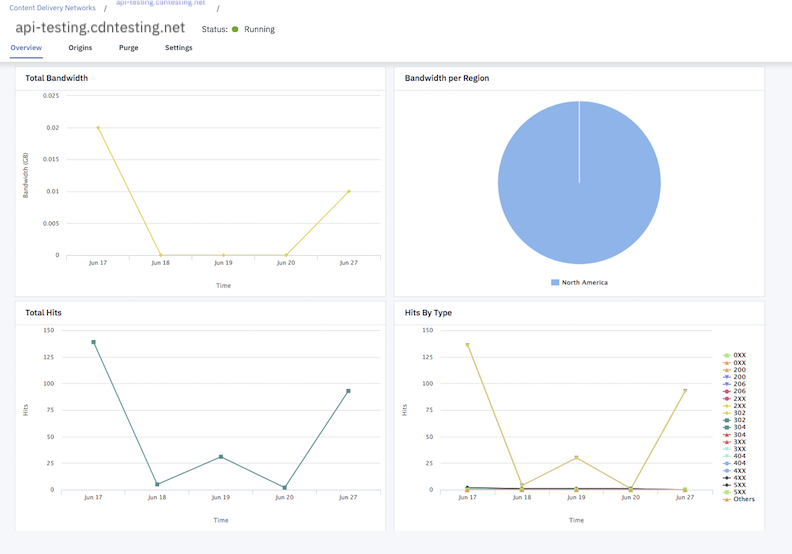

---

copyright:
  years: 2018, 2019
lastupdated: "2019-08-06"

keywords: metrics, bandwidth, overview, hit ratio, edge server, cache, ingress, hits

subcollection: CDN

---

{:shortdesc: .shortdesc}
{:new_window: target="_blank"}
{:codeblock: .codeblock}
{:pre: .pre}
{:screen: .screen}
{:tip: .tip}
{:download: .download}

# Metrics
{: #metrics}

When you first select your CDN from the list, the Overview page opens. Here you can see the Total Bandwidth, Total Hits and Hit Ratio for the selected time period (default is 30 days).

  

Directly beneath the overview, you will see a graphical representation of Total Bandwidth, Bandwidth per Region, Total Hits, and Hits By Type.

  

**NOTE**: After you create your CDN, it may take up to 48 hours for metrics to appear.

## Is there a minimum number of days for which I can view metrics? Is there a maximum?

There are a minimum and a maximum number of days for which you can view metrics using {{site.data.keyword.cloud}} Content Delivery Network with Akamai. Metrics can be gathered for a minimum of 7 days. Metrics can be viewed for a maximum of 90 days. For those using the API, it is recommended to use 89 days as the maximum, to account for any differences in time zones.

## Why is the hit ratio non-zero when total hits are zero?
Hit ratio represents the percentage of times the content was delivered from the Edge Server Cache, rather than being delivered from the Origin Server. It is calculated as follows:

`((Edge hits - Ingress hits)/Edge hits) * 100`

where:

_Edge hits_ is defined as "All hits to the edge servers from the end-users."  
_Ingress hits_ is defined as "Origin or Ingress hits are for traffic from your origin to Akamai edge servers."

Because Hit Ratio is calculated at the Account level and not per CDN, the Hit Ratio will be the same for all the CDNs in your account. This fact also explains why the Hit Ratio may be non-zero when the number of Edge hits for a particular CDN is zero.

## Are metrics updated in real-time?

No. Metrics are updated every 24 hours.
