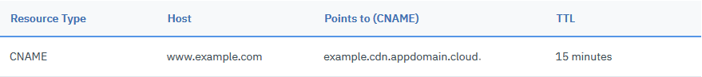

---

copyright:
  years: 2017, 2021
lastupdated: "2021-06-09"

keywords:

subcollection: CDN

---

{:shortdesc: .shortdesc}
{:new_window: target="blank"}
{:codeblock: .codeblock}
{:pre: .pre}
{:screen: .screen}
{:tip: .tip}
{:note: .note}
{:download: .download}
{:help: data-hd-content-type='help'}
{:support: data-reuse='support'}
{:faq: data-hd-content-type='faq'}

# Getting to Running status
{: #next-steps-after-ordering}

After you've ordered a CDN (and [completed the domain validation](/docs/CDN?topic=CDN-completing-domain-control-validation-for-https-with-dv-san) if the CDN is the SAN HTTPS mapping), the CDN status shows as `Cname configuration required`. To get your CDN to `Running` status, point your domain to [CDN CNAME](/docs/CDN?topic=CDN-getting-to-running-status#cdn-cname), which allows the Akamai edge servers to serve traffic for your domain.
{: shortdesc}

You might need to click the **Get status** button a few times before your CDN shows `Running` status.
{: note}

## For a Wildcard HTTPS CDN
{: #for-a-wildcard-https-cdn}

From the Overflow  menu, click **Get status** until your CDN shows `Running` status. It isn't necessary to configure any other settings or verify that CDN traffic works as expected. From here, you can review "How to" topics in the table of contents to configure and manage your CDN.

## For an HTTP-only CDN
{: #for-an-http-only-cdn}

Follow these steps to get your CDN up and running:

1. Verify whether CDN traffic works as expected. For instructions, see [Verifying that your CDN is working before pointing to IBM CNAME](/docs/CDN?topic=CDN-verify-cdn-before-pointing-domain-to-ibm-cname).
2. After you verify that CDN traffic is working, you must change your DNS record to point your domain to [IBM CNAME](/docs/CDN?topic=CDN-getting-to-running-status#ibm-cname). Most DNS providers can give you instructions on setting up or changing the CNAME.

   Check with your DNS provider to find out when the changes become active. Then, add a CNAME record for your CDN domain in DNS. To do so, on the DNS configuration page for your CDN domain, create a CNAME record with your CDN domain name as the **Host** and the CDN CNAME you used to configure the CDN as the **CNAME**.

   A typical CNAME record looks similar to the following:

   {: caption="Table 1: CNAME record for an HTTP-only CDN" caption-side="bottom"}

3. When the CNAME chaining is complete, highlight the table row of the CDN and click **Get status** from the Overflow  menu until your CDN shows `Running` status. Alternatively, if you are on the CDN's details page, click **Actions > Get status**.

Your CDN is now running. From here, you can review the "How to" topics to further configure and manage your CDN.

## For a SAN HTTPS CDN
{: #for-a-san-https-cdn}

Follow these steps to get your CDN up and running:

1. Address the domain validation challenge. For instructions, see [Completing Domain Control Validation for HTTPS with DV SAN](/docs/CDN?topic=CDN-completing-domain-control-validation-for-https-with-dv-san).
2. Verify whether CDN traffic works as expected. For instructions, see [Verifying that your CDN is working before pointing to IBM CNAME](/docs/CDN?topic=CDN-verify-cdn-before-pointing-domain-to-ibm-cname).
3. After you verify that CDN traffic is working, you must change your DNS record to point your domain to [IBM CNAME](/docs/CDN?topic=CDN-getting-to-running-status#ibm-cname). Most DNS providers can give you instructions on setting up or changing the CNAME.

   Check with your DNS provider to find out when the changes become active. Then, add a CNAME record for your CDN domain in DNS. To do so, on the DNS configuration page for your CDN domain, create a CNAME record with your CDN domain name as the **Host** and the IBM CNAME you used to configure the CDN as the **CNAME**.

   A typical CNAME record looks similar to the following:

   {: caption="Table 2: CNAME record for a SAN HTTPS CDN" caption-side="bottom"}

4. When the CNAME chaining is complete, highlight the table row of the CDN and click **Get status** from the Overflow  menu until your CDN shows `Running` status. Alternatively, if you are on the CDN's details page, click **Actions > Get status**.

Your CDN is now running. From here, you can review the "How to" topics in the table of contents to further configure and manage your CDN.

## CDN CNAME
{: #cdn-cname}

IBM CDN CNAME (also called an endpoint) can make your CDN mapping status to `Running` because it can resolve your domain to Akamai edge servers if you cname your domain to it. IBM provides two CNAMEs, and you can create CNAME record in your DNS system to point your CDN domain to one of the CNAMEs.

### IBM CNAME
{: #ibm-cname}

IBM CNAME is the default CNAME. It is suffixed with `cdn.appdomain.cloud.` or `cdnedge.bluemix.net.` (The old mapping created before 08/05/2019), and you can define the prefix during [creating new CDN mapping](/docs/CDN?topic=CDN-order-a-cdn).

The IBM CNAME is managed by IBM, and it is pointed to the Akamai's endpoint. The main function of IBM CNAME is ensuring your domain is still accessible when the CDN mapping is [Stopped](/docs/CDN?topic=CDN-stopping-a-cdn) by switching the DNS record to point to the origin.

Let's take a SAN HTTPS CDN mapping `example.cdn-demo.com` for example:
IBM CNAME: `example-cname.cdn.appdomain.cloud.`
Origin's hostname: `origin.example.com.`.

When the mapping is `Running`, the `dig` result of the domain resembles the following:

```sh
% dig +short example.cdn-demo.com
example-cname.cdn.appdomain.cloud.
example-cname.akamai.cdn.appdomain.cloud.
cert-00036-cdnedge-bluemix.akamaized.net.edgekey.net.
e24458.dsce16.akamaiedge.net.
23.xx.xx.xx
23.xx.xx.xx
...
```
{: codeblock}

The IBM CNAME is pointing to the `wildcard.appdomain.mdc.edgekey.net.`, which is the Akamai's endpoint for http-only mapping.

After the CDN is `Stopped`, the dig result of the domain resembles the following:

```sh
% dig +short example.cdn-demo.co
example-cname.cdn.appdomain.cloud.
origin.example.com
119.xx.xx.xx
```
{: codeblock}

Now the IBM CNAME is pointing to your own origin's hostname. By switching the DNS CNAME record target value, the IBM CNAME can ensure your domain still reachable even when the CDN is stopped.

For more informtion about IBM CNAME, see the [FAQ for CDN CNAME](#faq-for-cdn-cname).

### Akamai CNAME
{: #akamai-cname}

Akamai CNAME is the endpoint provided by Akamai. When your domain is cnamed to the Akamai CNAME, it can also resolve your domain to Akamai edge servers, and because it has fewer DNS chain nodes, it has a shorter DNS lookup time than the IBM CNAME.

In the previous CDN mapping `example.cdn-demo.com`, for example, the Akamai CNAME is `cert-00036-cdnedge-bluemix.akamaized.net.edgekey.net.`. If the domain is pointed to the Akamai CNAME, then the `dig` result looks like the following example.

```sh
% dig example.cdn-demo.com +short
cert-00036-cdnedge-bluemix.akamaized.net.edgekey.net.
e24458.dsce16.akamaiedge.net.
23.xx.xx.xx
23.xx.xx.xx
```
{: codeblock}

From this result, there are fewer CNAME nodes resolved in the DNS chain, and the DNS lookup time is much faster because it skips the IBM record.

The following table illustrates the Akamai CNAME for different type CDN mapping:

| CDN type | Akamai CNAME format  |
| ---------| -------------------- |
| HTTP-only| wildcard.appdomain.mdc.edgekey.net. |
| SAN HTTPS| cert-xxxxx-cdnedge-bluemix.akamaized.net.edgekey.net. |
| Wildcard HTTPS | N/A |
{: caption="Table 3: Akamai CNAME for CDN mapping" caption-side="bottom"}

For the Akamai CNAME, it's important to consider the following:

- The Akamai CNAME is only usable for the HTTP-only and SAN HTTPS mapping. For the Wildcard HTTPS mapping, it's only accessible by the IBM CNAME, so you don't have to set the DNS record for the CDN domain.
- The Akamai CNAME cannot ensure your domain is reachable if you STOPPED your CDN. You must manually set your DNS to point your domain to the origin if your domain is running service.
- For the SAN HTTPS CDN, the Akamai CNAME can only be generated when the CDN status has passed the `Domain validation required`.
- You can only point your domain to Akamai CNAME after the CDN mapping status is `RUNNING`. You cannot use Akamai CNAME to set the DNS record during the process of Domain validation.

For more information about Akamai CNAME, see the [FAQ for CDN CNAME](#faq-for-cdn-cname).

## FAQ for CDN CNAME
{: #faq-for-cdn-cname}

### Can I configure my domain without pointing it to a CDN CNAME?
{: #point-domain-to-none-cdn-cname}
{: faq}

No, you cannot configure your domain without pointing it to a CDN CNAME. You can point your domain only to a CDN CNAME (IBM CNAME or the Akamai CNAME). This way, you can guarantee that your domain is globally distributed to the closest and most efficient edge server for your clients.

The IP addresses of an Akamai edge server are changed dynamically; therefore, setting a fixed Akamai IP address for your domain might cause your traffic to fail.
{: note}

### Can I update the IBM CNAME or Akamai CNAME?
{: #can-i-edit-cdn-cname}
{: faq}

No, you can't update the IBM CNAME or Akamai CNAME. You can only define the prefix of the IBM CNAME when you're creating the CDN. The Akamai CNAME is generated automatically by Akamai and you do not have to define or edit it.

### When should I use the Akamai CNAME instead of IBM CNAME?
{: #when-to-use-akamai-or-ibm-cname}
{: faq}

Akamai CNAME provides a shorter DNS lookup time for your domain. The Akamai CNAME improves the performance of your website by shortening the DNS resolution time.

   You can only point your domain to the Akamai CNAME when the CDN mapping status is in `RUNNING` state.
   {: note}

### What happens if a domain is still pointing to Akamai CNAME when the CDN is stopped?
{: #what-will-happen-stopped-cdn-akamai-cname}
{: faq}

When the CDN is stopped, a Deny_All rule is added for the domain on the Akamai side. Even if the domain can still be resolved to Akamai by pointing to Akamai CNAME, the traffic for the domain is denied, and the response is similar to the following:

```sh
HTTP/2 403
server: AkamaiGHost
mime-version: 1.0
content-type: text/html
content-length: 269
expires: Tue, 15 Sep 2020 07:54:31 GMT
date: Tue, 15 Sep 2020 07:54:31 GMT

<HTML><HEAD>
<TITLE>Access Denied</TITLE>
</HEAD><BODY>
<H1>Access Denied</H1>

You do not have permission to access "http://xxxx;" on this server.<P>
Reference&#32;&#35;18&#46;9df02817&#46;1600156471&#46;bf3f7f1
</BODY>
</HTML>
```
{: codeblock}

### Where I can find the Akamai CNAME?
{: #where-find-akamai-cname}
{: faq}

You can find the Akamai CNAME in the following ways:
- From the console, you can click into the CDN domain, and view the Akamai CNAME in **Overview > Details**.
- From the API, use the [list domain mapping by uniqueid](https://cloud.ibm.com/docs/CDN?topic=CDN-cdn-api-reference#listdomainmappingbyuniqueid) or the [list all domain mapping](https://cloud.ibm.com/docs/CDN?topic=CDN-cdn-api-reference#listdomainmappings) commands to get the Akamai CNAME.

### Why is the Akamai CNAME empty or shown as `-`?
{: #why-akamai-cname-none}
{: faq}

If you are using wildcard CDN mapping, there's no Akamai CNAME associated. If you just created the SAN HTTPS mapping, the Akamai CNAME can only be generated when the mapping is in the `Domain validation required` status. That's because Akamai can only generate the Akamai CNAME when the certificate is selected. Before the `Domain validation required` status is active,  the `-` character is shown as the Akamai CNAME value.
