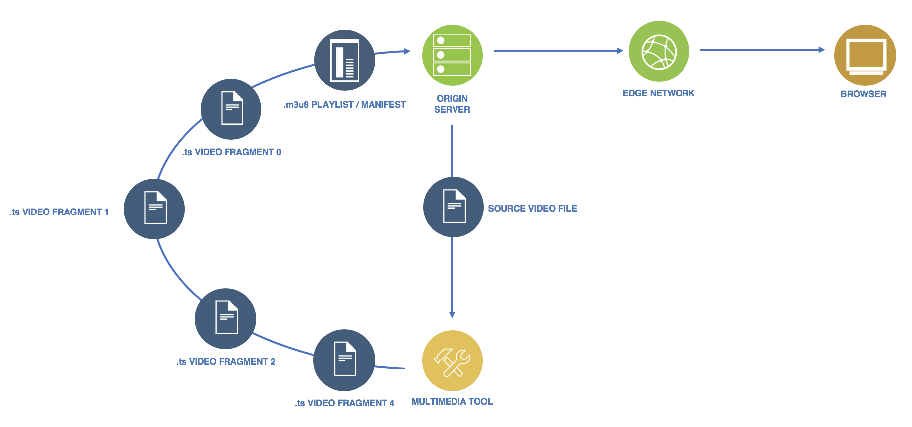

---

copyright:
  years: 2018, 2019
lastupdated: "2020-03-27"

keywords: video, mp4, formats, MPEG, nginx, player, configuration, streaming, stream, files, demand, ffmpeg

subcollection: CDN

---

{:shortdesc: .shortdesc}
{:new_window: target="_blank"}
{:codeblock: .codeblock}
{:pre: .pre}
{:screen: .screen}
{:tip: .tip}
{:download: .download}


# Serving Video on Demand with CDN
{: #how-to-serve-video-on-demand-with-cdn}

Explore an example of how to use {{site.data.keyword.cloud}} CDN to stream `.mp4` content through **HLS** as video on demand, to a browser from a Linux-Nginx origin.
{:shortdesc}

## Introduction
{: #introduction}

A number of formats, such as HLS, MPEG-DASH, and so on, are available to stream video.

Conceptually, the setup we're using is shown in the following diagram:



We'll also use the origin as the place for preparation. On that, we'll also need to obtain a few packages to make this work.

And so, let's start by updating the origin's package list.
```
$ sudo apt-get update
```

## Preparing video files
{: #prepare-video-files}

In this guide, we'll use `ffmpeg` to prepare the video files. It is a powerful tool for multimedia files that can convert, mux, demux, filter, and so forth, through its various commands.

First, we'll obtain `ffmpeg`.
```
$ sudo apt-get -y install ffmpeg
```

HLS works with two types of files: `.m3u8` and `.ts`. You can think of the `.m3u8` file as the "playlist." At the beginning of the video stream, this file is the first one that is fetched.  The playlist then informs the video player about the video fragments it should fetch, and it provides other data on how to play the streamed content successfully. The `.ts` files are the video "fragments." These fragments are fetched and played by the video player according to details given in the "playlist."

Now, let's check and see the format, bit rate, and other information, for the video and audio streams of our source `.mp4` video.

```
$ ffprobe test-video.mp4
```

In this example, let's consider the following stream information for `test-video.mp4`:

  * Video stream 0
    * Format: h264
    * Format profile: High
    * Resolution: 1920x1080
    * Bit rate: 438 kb/s
    * Frame rate: 30.30 fps
  * Audio stream 0
    * Format: aac
    * Sample rate: 48000
    * Bit rate: 128k

Now, we'll convert our `test-video.mp4` file into the formats for HLS.

```
$ ffmpeg -i test-video.mp4 -c:a aac -ar 48000 -b:a 128k -c:v h264 -profile:v main -crf 23 -g 61 -keyint_min 61 -sc_threshold 0 -b:v 5300k -maxrate 5300k -bufsize 10600k -hls_time 6 -hls_playlist_type vod test-video.m3u8
```

Here is the breakdown of what this command did:

|Arguments|Effect|
|:---|:---|
| ffmpeg | Use the `ffmpeg` tool. |
| -i test-video.mp4 | The source video is located at `test-video.mp4`. |
| -c:a acc | Use the acc audio codec for the output. |
| -ar 48000 | Set the audio sample rate to 48000 Hz for the output. |
| -b:a 128k | Set the audio bit rate to 128000 bits/second for the output. |
| -c:v h264 | Use the `h.264` video codec for the output. |
| -profile:v main | Use the "main" format profile of the selected codec for widest device support. |
| -crf 23 | Attempt to maintain the video quality with varying file size and bit rate.<br/>  The lower the CRF, the higher the quality and file size. |
| -g 61 -keyint_min 61 | Set a maximum and minimum.<br/> With the example source frame rate as 30.30, a keyframe should be <br/> inserted every 2 seconds (61 frames). |
| -sc_threshold 0 | Disable scene detection by `ffmpeg`.<br/> Prevents a second process that might insert extraneous keyframes into the output. |
| -b:v 5300k | Sets the output video stream's target bitrate to 5300000 bits/second. |
| -maxrate 5300k | Limits the maximum output video bitrate at<br/> the encoder to 5300000 bits/second, in case it varies. |
| -bufsize 10600k | Sets the `ffmpeg` video decoder buffer size to 10600000 bits.<br/>  With 5300k bitrate, the `ffmpeg` encoder should check and <br/> attempt to readjust the output bit rate back to the target bit rate for every 2 seconds of video. |
| -hls_time 6 | Attempt to target each output video fragment length to 6 seconds.<br/> Accumulates frames for at least 6 seconds of video, and then<br/> stops to break off a video fragment when it encounters the next keyframe. |
| -hls_playlist_type vod | Prepares the output `.m3u8` playlist file for Video on Demand (VOD). |
| test-video.m3u8 | Name the output playlist/manifest file to `test-video.m3u8`.<br/> As a result, `test-video0.ts`, `test-video1.ts`, `test-video2.ts`, ..., and similar,<br/> will be the video fragment's names by default.|

Note, for the `-` options, unless a stream is specified, the "best" one for its category is chosen.

Such as:
  * `-c:a` chooses the audio stream with the most channels.
  * `-c:v` chooses the video stream with the highest resolution.
  * `-c:a:0` chooses audio stream 0.
  * `-c:v:0` chooses video stream 0.

In this guide, only one audio stream and one video stream make up the example `test-video.mp4`. And so, the difference would not be a concern moving forward.

Afterward, you can expect to see a number of `.ts` files.  Additionally, you can expect to see a `.m3u8` file that looks something like the following:

```
$ cat test-video.m3u8
#EXTM3U
#EXT-X-VERSION:3
#EXT-X-TARGETDURATION:7
#EXT-X-MEDIA-SEQUENCE:0
#EXT-X-PLAYLIST-TYPE:VOD
#EXTINF:6.039000,
test-video0.ts
#EXTINF:6.039000,
test-video1.ts
#EXTINF:6.039000,
test-video2.ts
#EXTINF:6.039000,
test-video3.ts
#EXTINF:6.039000,
test-video4.ts
#EXTINF:6.039000,
test-video5.ts
#EXTINF:6.039000,
test-video6.ts
#EXTINF:6.039000,
test-video7.ts
#EXTINF:6.039000,
test-video8.ts
#EXTINF:6.039000,
test-video9.ts
#EXTINF:6.039000,
test-video10.ts
#EXTINF:4.620000,
test-video11.ts
#EXT-X-ENDLIST
```
{: screen}

For more complex use cases, such as scaling video resolution, working with subtitles, HLS AES encryption on video fragments for security and authorization, and so on--`ffmpeg` has many  moreargument options that handle the more complex and specific features. You can find descriptions of these arguments in [ffmpeg's general documentation](https://ffmpeg.org/ffmpeg.html) and in its [documentation on specific formats such as HLS](https://ffmpeg.org/ffmpeg-formats.html#hls).

## Preparing the origin
{: #prepare-the-origin}

### Server
{: #server}

If you're using this server as an additional origin under a second domain from which to stream these HLS, you might need to configure the server to return CORS response headers for potential browser access.

You can place the HLS files under any directory or subdirectory you like. For this example, let's place the HLS files under `/usr/share/nginx/hls/`.

The following Nginx configuration would cover that in the basic sense:

```
# Some configurations for this main context...

http {

    # Some configurations for this http context...

    server {

        # Some virtual host configurations here...

        location /hls {
            root /usr/share/nginx/;

            # CORS simple requests
            if ($request_method = 'GET') {
                add_header 'Access-Control-Allow-Origin' '*';
                add_header 'Access-Control-Expose-Headers' 'Content-Length, Content-Type';
            }

            # CORS preflight requests
            if ($request_method = 'OPTIONS') {
                add_header 'Access-Control-Allow-Origin' '*';
                add_header 'Access-Control-Allow-Methods' 'GET, OPTIONS';

                # Note: wildcard `Access-Control-Allow-Headers` might not be supported by all browsers, yet.
                add_header 'Access-Control-Allow-Headers' '*';

                add_header 'Access-Control-Max-Age' 1728000;
                add_header 'Content-Type' 'text/plain; charset=utf-8';
                add_header 'Content-Length' 0;
                return 204;
            }

            try_files $uri =404;
        }

        # Some more virtual host configurations...
    }

    # Some more configurations for this http context...
}

# Some more configurations for this main context...
```
{: screen}

### Video player on the webpage
{: #video-player-on-the-webpage}

Not all streaming video formats are natively playable on all applications. The example in this guide sets up streaming using HLS and CDN.

For example, Safari would support native, HLS playback. And so, the video player on the webpage might be as simple as the following example using HTML5 `<video>` elements:

```
<!DOCTYPE html>
<html>
  <!-- Some HTML elements... -->

  <video src="https://cdn.example.com/hls/test-video.m3u8"></video>

  <!-- Some more HTML elements... -->
</html>
```
{: screen}

However, other browsers on desktop devices might also need support from added JavaScript [Media Source Extensions](https://www.w3.org/TR/media-source/), whether developed in-house or from a trusted third party, to generate content streams playable through HTML5.

## Configuring the CDN
{: #configure-the-cdn}

Now, let's connect the origin to the CDN to serve content worldwide with optimized throughput, minimized latency, and increased performance.

First, [order and configure a CDN](/docs/CDN?topic=CDN-order-a-cdn). Then, under **Optimize for**, select **Video on demand optimization**.
