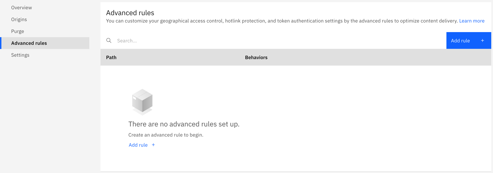
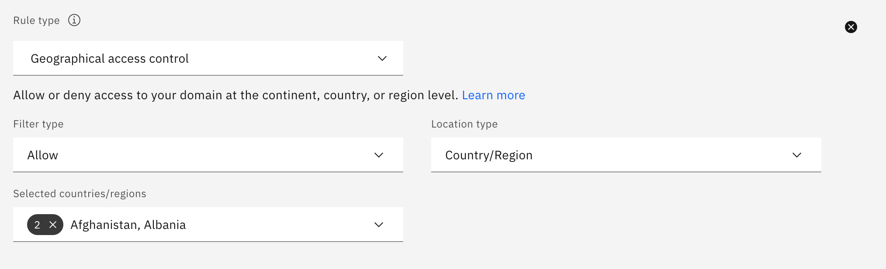
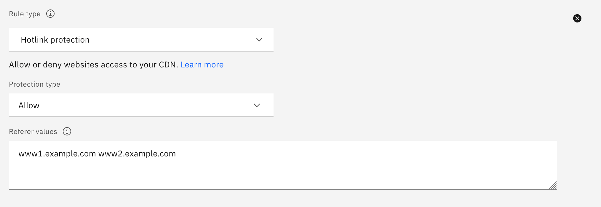
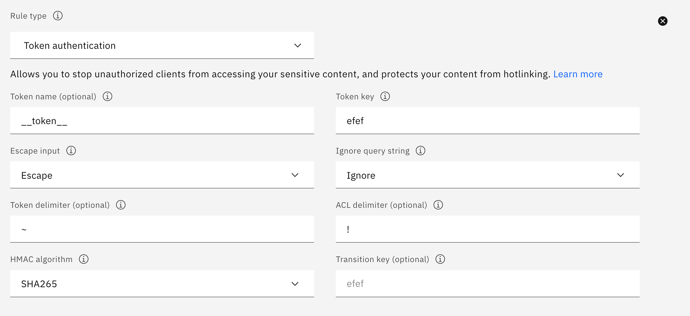
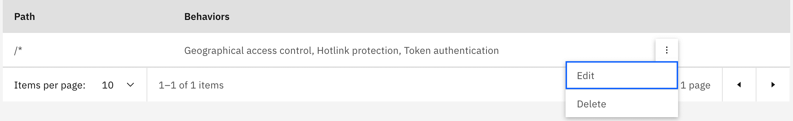

---

copyright:
  years: 2021
lastupdated: "2021-07-07"

keywords: hotlink protection, geographical access control, token authentication

subcollection: CDN

---

{{site.data.keyword.attribute-definition-list}}

# Setting advanced rules
{: #setting-advanced-rules}

After your CDN is running, you can set advanced rules to optimize network performance. For example, control access through geoblocking, or protect your content from hotlinking.

1. On the CDN page, select your CDN. When the **Overview** page appears, select the **Advanced rules** tab.

   {: caption="Advanced rules tab" caption-side="bottom"}

2. Click **Add rule**. A window appears where you can configure your rule.
3. Provide a path. For example, use a global path `/*` (`www.example.com/*`), or a subpath `/home/example/*` (`www.example.com/home/example/*`).
4. Select a rule type to configure behavior settings. Choices are as follows:

   If using a subpath like `/home/example/*`, token authentication is currently the only supported rule type.
   {: note}

   * **Geographical access control** - Select the filter type, location type, and continents (or countries/regions) that you want to allow or deny access to your domain. If you do not specify a configuration for geographical access control, all countries/regions are allowed. For more information, see [Geographical access control](/docs/CDN?topic=CDN-about-content-delivery-networks-cdn-#geographical-access-control).

    {: caption="Add geographic access control" caption-side="bottom"}

   * **Hotlink protection** - Select the protection type and provide the referer URLs (separated by a space) that you want to allow or deny website access to your CDN. For more information, see [Hotlink protection](/docs/CDN?topic=CDN-about-content-delivery-networks-cdn-#hotlink-protection).

    {: caption="Add hotlink protection" caption-side="bottom"}

   * **Token authentication** - Provide the token key, set the escape input and ignore query string, and then select the HMAC algorithm. Optionally, specify the token name, token delimiter, ACL delimiter, and transition key. If you do not specify a value for an optional parameter, the default value is used. For more information, see [Token authentication](/docs/CDN?topic=CDN-about-content-delivery-networks-cdn-#token-authentication).

      You cannot set the token and ACL delimiters to the same value.
      {: note}

      {: caption="Add token authentication" caption-side="bottom"}

5. Click **Add** to save the configuration. The newly added rule is listed in the table.
6. After you add a rule, you can click the overflow menu  to **Edit** or **Delete** the rule.

   You cannot change the path of the rule.
   {: note}

   {: caption="Edit or delete advanced rule" caption-side="bottom"}
