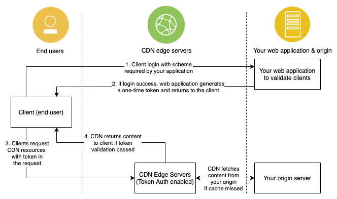

---

copyright:
  years: 2020
lastupdated: "2020-08-31"

keywords: token authentication

subcollection: CDN

---

{:shortdesc: .shortdesc}
{:new_window: target="_blank"}
{:codeblock: .codeblock}
{:pre: .pre}
{:screen: .screen}
{:term: .term}
{:tip: .tip}
{:note: .note}
{:important: .important}
{:deprecated: .deprecated}
{:table: .aria-labeledby="caption"}
{:external: target="_blank" .external}
{:table: .aria-labeledby="caption"}
{:generic: data-hd-programlang="generic"}
{:download: .download}
{:DomainName: data-hd-keyref="DomainName"}
{:help: data-hd-content-type='help'}
{:support: data-reuse='support'}

# Working with token authentication
{: #working-with-token-authentication}
{: help}
{: support}

Token authentication can stop unauthorized clients from accessing your sensitive content, and protects your content from _hotlinking_. By enabling token authentication on CDN, requests are authenticated by CDN edge servers before the CDN delivers the content.
{:shortdesc}

## How it works
{: #how-it-works-token-authentication}

The following diagram shows how the CDN token authentication works with your web application to validate the client's requests.

   

In the diagram, before a client requests the protected contents, they must get a token from your web application. Your web application logic (for instance, username and password) validates the request. If the validation passes, it generates a one-time token and returns it to the client.

When the client requests the CDN contents, they must pass the token in a cookie, query string parameter, or request header. The request goes to the CDN edge server, and the edge server attempts to match it with the local token-auth setting. If the token is a verified match, the content is returned to the client. If the token doesn't match, the edge server returns a `403` response.

With token authentication, request verification occurs only in the CDN edge servers, your back end application server isn't needed. This can reduce the network latency and offload to your server.

### Generating the access token
{: #generate-the-access-token}

Generate an access token and apply it to content you want to protect. The token is a delimited list of string fields, with an HMAC to prevent tampering with the strings. Each field consists of a value that is verified by CDN edge servers when a request is made.

It is recommended that you set up your origin server to dynamically generate these tokens for each client request for the protected content. This way, you can include the IP address (IP) as a parameter and restrict access to protected content to that specific authorized user.

Akamai offers Token Auth software development kits (SDK) in multiple programming languages, which you can use to generate this token. They account for all required and optional fields.

See the following readme file pages for details on how to use the SDK of your choice.

- [C Sharp ("C#")](https://github.com/BookBeat/EdgeAuth-Token-CSharp){:external}
- [Golang ("Go")](https://github.com/mobilerider/EdgeAuth-Token-Golang){:external}
- [Java](https://github.com/akamai/EdgeAuth-Token-Java){:external}
- [NodeJS](https://github.com/akamai/EdgeAuth-Token-Node){:external}
- [Python](https://github.com/akamai/EdgeAuth-Token-Python){:external}
- [Ruby](https://github.com/akamai/EdgeAuth-Token-Ruby){:external}

You can refer to Step 2 in [Example to set token authentication](/docs/CDN?topic=CDN-working-with-token-authentication#example-to-set-token-authentication).

### Applying the token
{: #apply-the-token}

Attach the completed token to the URL for your target content as a query string parameter, cookie, or request header.

Token authentication generally requires the use of browser cookies to deliver a signed token as a step in the authorization process. This can affect devices and browsers that don't support using cookies, such as Apple Safari and HLS devices.

While users can manually enable cookies on any browser, Safari users must manually enable cookies. If not already done, Safari users must set `Preferences > Security > Accept Cookies: Always`. After this preference is set, no additional interaction is required and token authorization works as designed.

## Example to set token authentication
{: #example-to-set-token-authentication}

The following example illustrates how to set token authentication. One customer wants to protect resources under the path `/private/*` of `www.cdn-domain.com`, and the following steps show you how to set the token authentication.

1. Create the encryption key.
{: #create-encryption-key}

    The key is an even number of hex digits for the token key. An entry can be up to 64 characters in length. To ensure that your key is random, it is recommended that you create the key by using the [OpenSSL tool](https://www.openssl.org/){:external}.

    For example:

    For example:

    ```shell
    openssl rand -hex 32
    ```
    {:codeblock}

    The output looks like:

    ```
    87e23a68764b79b4deb46a521ae7a8a49f156460e6461f3b6cc633bf8a548381
    ```
    {:pre}

    You can also generate a second transition encryption key to serve as a backup "trusted shared secret". If the token provided by the user is not valid based on the primary encryption key, the edge server checks the token using the transition key. This ensures that users are not denied access if you are in the process of rotating the primary key.

    This assumes that you transitioned to generating your tokens with the transition key for some period of time before updating the encryption key value.
    {:note}

2. Generate the token.
{: #generate-the-token}

    The following is an example that uses [Python SDK](https://github.com/akamai/EdgeAuth-Token-Python){:external} to generate the token with the primary or the transition key that is generated in [step 1](#create-encryption-key).

    ```python
    #!/usr/bin/python
    # -*- coding: UTF-8 -*-

    from akamai.edgeauth import EdgeAuth, EdgeAuthError

    ET_TOKEN_NAME = '__token__' # token name
    ET_ENCRYPTION_KEY = '87e23a68764b79b4deb46a521ae7a8a49f156460e6461f3b6cc633bf8a548381' # Encryption key
    DEFAULT_WINDOW_SECONDS = 5000 # The token valid time in seconds

    et = EdgeAuth(**{'token_name': ET_TOKEN_NAME,
                     'key': ET_ENCRYPTION_KEY,
                     'window_seconds': DEFAULT_WINDOW_SECONDS})

    acl_path = ["/private/*"]  # The path(s) you want to protect
    token = et.generate_acl_token(acl_path)

    print('token: ', token)
    ```
    {: codeblock}

    This code generates a token that is a string, and looks like the following:

    ```
    exp=1598342003~acl=/private/*~hmac=73cbcba0137b4875b10a3264d4c24189a91825e51f2764af0891a854d015dd08
    ```
    {:pre}

    You can set the token string as cookie to the client.

3. Set token authentication in CDN.
{: #set-token-authentication-in-cdn}

    You can refer to this [example to create a token authentication](/docs/CDN?topic=CDN-code-examples-using-the-cdn-api#create-token-auth-example) by [token authentication API](/docs/CDN?topic=CDN-cdn-api-reference#api-for-token-authentication).

    You need to replace the parameter values in the example to the correct ones you're using, and ensure the token authentication values (encryption key(s), token name, ...) match the values in the token generation code in [step 2](#generate-the-token).
    {:note}

4. Verify the token authentication function.
{: #verify-the-token-authentication-function}

    First, access the contents without the token.

    ```shell
    curl -i "http://www.cdn-domain.com/private/test.txt"
    HTTP/1.1 403 Forbidden
    ...

    <HTML><HEAD>
    <TITLE>Access Denied</TITLE>
    </HEAD><BODY>
    <H1>Access Denied</H1>

    You don't have permission to access "http://www.cdn-domain.com/private/test.txt" on this server.
    Reference #18.ef3ce17.1598346101.6c7c336e
    </BODY>
    </HTML>
    ```
    {:codeblock}

    Without the token, the edge server returns a `403` response code that indicates the user has no permission to access the content.

    Next, pass the token in a cookie and make the request again.

    ```shell
    curl -i "http://www.cdn-domain.com/private/test.txt" --cookie "__token__=exp=1598348288~acl=/private/*~hmac=73cbcba0137b4875b10a3264d4c24189a91825e51f2764af0891a854d015dd08"
    HTTP/1.1 200 OK
    ...
    ```
    {:codeblock}

    `200` response code is returned and the content is successfully returned by the CDN edge server.
