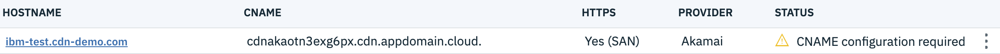
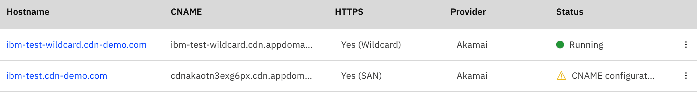

---

copyright:
  years: 2019, 2020
lastupdated: "2020-02-24"

keywords: traffic, verify, hostname, hosts file, dns, cname, record, CNAME configuration required, wildcard

subcollection: CDN

---

{:shortdesc: .shortdesc}
{:new_window: target="_blank"}
{:external: target="_blank" .external}
{:DomainName: data-hd-keyref="DomainName"}
{:note: .note}
{:tip: .tip}
{:important: .important}
{:deprecated: .deprecated}
{:generic: data-hd-programlang="generic"}
{:codeblock: .codeblock}
{:pre: .pre}
{:screen: .screen}
{:download: .download}
{:help: data-hd-content-type='help'}
{:support: data-reuse='support'}

# Verifying that your CDN is working before pointing to IBM CNAME
{: #verify-cdn-before-pointing-domain-to-ibm-cname}
{: help}
{: support}

For **HTTP only** and **SAN HTTPS** CDN mappings only, you must verify that your CDN is working before switching the domain to use the CDN.
{:shortdesc}

All the commands, tools, and files that are used in this example are based on the `Ubuntu 16.04.5 LTS` system. Your examples might vary if you are using another OS or different Ubuntu versions.
{: note}

For this example, we created the following CDN mapping:



* CDN hostname: `ibm-test.cdn-demo.com`
* CDN CNAME: `cdnakaotn3exg6px.cdn.appdomain.cloud.`
* Origin path: `/*`
* Origin port: `80` & `443`
* Origin IP address: `119.xx.xx.xx`
* Origin host header: `ibm-test.cdn-demo.com`
* Certificate type: `SAN HTTPS`
* The current CDN status: `CNAME configuration required`

The domain `ibm-test.cdn-demo.com` is pointing to the Origin server:

```shell
dig +short ibm-test.cdn-demo.com
119.xx.xx.xx
```
{:pre}

and a service is running on it:

```shell
curl -s -o origin-index.html -D - https://ibm-test.cdn-demo.com/index.html
HTTP/1.1 200 OK
Server: nginx/1.14.0
Date: Tue, 18 Feb 2020 05:40:45 GMT
Content-Type: text/html
...
```
{:pre}

Because there is a service running on the domain, we recommend that you verify the CDN functionality before beginning domain migration to CDN.

## Changing local hosts to verify CDN traffic
{: #changing-local-hosts-to-verify-cdn-traffic}

When CDN mapping status is in `CNAME configuration required`, all the configurations in IBM and on the Akamai side (for example, DNS, policies, certificates) are ready and waiting for you to point the hostname to IBM CNAME.

In almost all operating systems, there is a local hosts file that maps hostnames to IP addresses, and changes there only affect your own computer without affecting how the domain is resolved worldwide. It's safe to point the domain to IBM CNAME by changing the local hosts file. See the following steps for how to do this.

1. Get the Akamai edge server's IP address.

   By performing name resolution of IBM CNAME, you can easily get IP addresses of Akamai edge server. The `dig` result is similar to this one:

   ```bash
   dig +short cdnakaotn3exg6px.cdn.appdomain.cloud.
   cdnakaotn3exg6px.akamai.cdn.appdomain.cloud.
   cert-00033-cdnedge-bluemix.akamaized.net.edgekey.net.
   e24455.dsce16.akamaiedge.net.
   104.84.150.124
   104.84.150.67
   ```
   {:pre}

   The DNS chain and the IP addresses resolved on your machine might be different.
   {: tip}

2. Make a backup copy of your original local hosts file. To do so, use your favorite editor to open your local hosts file `/etc/hosts`, and add the IP-hostname entry into it. You can choose any one of the IP addresses resolved in the prior step.

   For example:

   ```
   104.84.150.124 ibm-test.cdn-demo.com
   ```
   {:screen}

3. Verify the hosts change. You can use the `ping` command to resolve and test the IP address.

   ```bash
   ping ibm-test.cdn-demo.com
   PING ibm-test.cdn-demo.com (104.84.150.124) 56(84) bytes of data.
   64 bytes from ibm-test.cdn-demo.com (104.84.150.124): icmp_seq=1 ttl=59 time=1.66 ms
   64 bytes from ibm-test.cdn-demo.com (104.84.150.124): icmp_seq=2 ttl=59 time=1.42 ms
   64 bytes from ibm-test.cdn-demo.com (104.84.150.124): icmp_seq=3 ttl=59 time=1.52 ms
   64 bytes from ibm-test.cdn-demo.com (104.84.150.124): icmp_seq=4 ttl=59 time=1.42 ms
   ^C
   --- ibm-test.cdn-demo.com ping statistics ---
   4 packets transmitted, 4 received, 0% packet loss, time 3005ms
   rtt min/avg/max/mdev = 1.420/1.507/1.662/0.099 ms
   ```
   {:pre}

   From this result, we can see the IP address of `ibm-test.cdn-demo.com` was resolved to Akamai edge server's IP address (`104.84.150.124`) that was added into the local hosts file. This means that the `/etc/hosts` file change took effect.

4. Verify the CDN traffic. You can add the [Akamai debug headers](/docs/CDN?topic=CDN-troubleshooting#how-do-I-know-my-cdn-is-working) to request the domain.

   ```bash
   curl -s -o cdn-test-index.html -D - \
       -H "Pragma: akamai-x-cache-on, akamai-x-cache-remote-on, akamai-x-check-cacheable, akamai-x-get-cache-key, akamai-x-get-extracted-values, akamai-x-get-ssl-client-session-id, akamai-x-get-true-cache-key, akamai-x-serial-no, akamai-x-get-request-id,akamai-x-get-nonces,akamai-x-get-client-ip,akamai-x-feo-trace" \
       https://ibm-test.cdn-demo.com/index.html
   HTTP/1.1 200 OK
   Server: nginx/1.14.0
   Content-Type: text/html
   ...
   Date: Tue, 18 Feb 2020 07:16:56 GMT
   Content-Length: 1524
   ...
   ...
   X-Check-Cacheable: YES
   ```
   {:pre}

   If Akamai debug headers are returned, and the response code and content are the same as before, then it means the CDN traffic works. Refer to [Troubleshooting](/docs/CDN?topic=CDN-troubleshooting) to further debug.

   Along with the basic function verification, it is recommended that you verify more functions that you plan to use, for example, caching, multiple origins, purge, and so on.
   {: important}

6. Restore your original local hosts file using the backup copy created in Step 2.   

## Using wildcard CDN to verify CDN traffic
{: using-wildcard-cdn-to-verify-cdn-traffic}

The wildcard CDN does not need the DNS record changed to point the domain to the IBM CNAME. The IBM CNAME can be used to access the service, which makes it fast and easy to verify CDN traffic.

Take the following steps to verify CDN with wildcard certificate.

1. Create a new wildcard CDN mapping with a new temporary domain (for example `ibm-test-wildcard.cdn-demo.com`). This wildcard CDN is only for testing, and it must have the same configuration as the wanted CDN `ibm-test.cdn-demo.com`. The following configurations, at a minimum, must be the same:

   * Origin path
   * Origin port type and number
   * Origin hostname
   * Origin hostheader

  The wildcard CDN now shows a final list similar to the following image.

   

2. Verify the wildcard traffic. You can add the [Akamai debug headers](/docs/CDN?topic=CDN-troubleshooting#how-do-I-know-my-cdn-is-working) to request the wildcard CDN's IBM CNAME.

   ```bash
   curl -s -o cdn-test-wildcard-index.html -D - \
       -H "Pragma: akamai-x-cache-on, akamai-x-cache-remote-on, akamai-x-check-cacheable, akamai-x-get-cache-key, akamai-x-get-extracted-values, akamai-x-get-ssl-client-session-id, akamai-x-get-true-cache-key, akamai-x-serial-no, akamai-x-get-request-id,akamai-x-get-nonces,akamai-x-get-client-ip,akamai-x-feo-trace" \
       https://ibm-test-wildcard.cdn.appdomain.cloud/index.html
   HTTP/1.1 200 OK
   Server: nginx/1.14.0
   Content-Type: text/html
   ...
   Date: Tue, 18 Feb 2020 07:16:56 GMT
   Content-Length: 1524
   ...
   ...
   X-Check-Cacheable: YES
   ```
   {: pre}

   If Akamai debug headers are returned, and the response code and content match the content that is returned from the wanted domain, then it means the wildcard CDN traffic works. Refer to the [troubleshooting](/docs/CDN?topic=CDN-troubleshooting) to further debug.

     Along with the basic function verification, we recommend that you verify more functions that you plan to use, for example, caching, multiple origins, purge, and so on.
     {: important}
